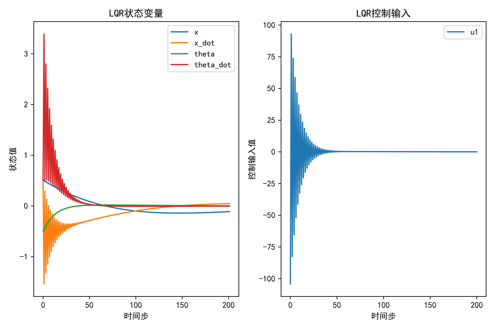

# Cartpole建模与PID、LQR、MPC控制算法的Python实现

### CartPole问题的目标是保持杆子竖直（角度为0）和小车在轨道中心（位置为0）。

教程中不涉及公式推导，如需了解PID\LQR\MPC的底层原理，可自行学习。

## 一、所用环境和基础
1. Windows
2. 矩阵论与控制理论
3. 环境安装见requirments.txt

## 二、Cartpole建模

Cartploe官方的动力学模型定义部分代码如下所示，参考http://incompleteideas.net/sutton/book/code/pole.c

详细可参考code中的cartpole_env.py文件，在实践过程中，为了适应线性控制器，我们对动力学模型进行了近似处理，将于后面进行介绍。

```python
# temp = (force + self.polemass_length * theta_dot * theta_dot * sintheta) / self.total_mass
# thetaacc = (self.gravity * sintheta - costheta * temp) / (self.length * (4.0 / 3.0 - self.masspole * costheta * costheta / self.total_mass))
# xacc = temp - self.polemass_length * thetaacc * costheta / self.total_mass
```

转换成公式可以表示为：

$$
\left\\{\begin{array}{l}
\ddot{x}=\frac{F+m_{p} l \dot{\theta}^{2} \sin \theta}{m_{p}+m_{c}}-\frac{m_{p} l \dot{\theta}^{2} \sin \theta}{m_{p}+m_{c}} \\
\ddot{\theta}=\frac{g \sin \theta-\cos \theta \cdot \frac{F+m_{p} l \dot{\theta}^{2} \sin \theta}{m_{p}+m_{c}}}{l\left(\frac{4}{3}-\frac{m_{p} \cos \theta^{2}}{m_{p}+m_{c}}\right)}
\end{array}\right.
$$

针对线性控制器，由于倒立摆的 $\theta$ 角很小，可以做近似处理，因此将 $\theta$ 趋近于0，同时 $\sin \theta$ 和 $\cos \theta$ 也做近似处理，可以得到， $\sin \theta \approx \theta$ ， $\cos \theta \approx 1$ ，经过近似处理后，公式可以表示为：

$$
\left\\{\begin{array}{l}
\ddot{x}=\left(\frac{1}{m_{p}+m_{c}}+\frac{3 m_{p}}{m_{p}+4 m_{c}}\right) F-\frac{3 m_{p} g}{m_{p}+4 m_{c}} \theta \\
\ddot{\theta}=\frac{3 g\left(m_{p}+m_{c}\right) \theta}{l\left(m_{p}+4 m_{c}\right)}-\frac{3 F}{l\left(m_{p}+4 m_{c}\right)}
\end{array}\right.
$$

将上式整理为状态空间方程，可得：

$$
\left[\begin{array}{c}
\dot{x} \\
\ddot{x} \\
\dot{\theta} \\
\ddot{\theta}
\end{array}\right]=\left[\begin{array}{cccc}
0 & 1 & 0 & 0 \\
0 & 0 & -\frac{3 m_{p} g}{m_{p}+4 m_{c}} & 0 \\
0 & 0 & 0 & 1 \\
0 & 0 & \frac{3 g\left(m_{p}+m_{c}\right)}{l\left(m_{p}+4 m_{c}\right)} & 0
\end{array}\right]\left[\begin{array}{c}
x \\
\dot{x} \\
\theta \\
\dot{\theta}
\end{array}\right]+\left[\begin{array}{c}
0 \\
\frac{1}{m_{p}+m_{c}}+\frac{3 m_{p}}{m_{p}+4 m_{c}} \\
0 \\
-\frac{3}{l\left(m_{p}+4 m_{c}\right)}
\end{array}\right] F
$$

状态空间方程在LQR和MPC代码中使用，对应的python代码如下所示：
```python
A = np.eye(4) + del_t * np.array([[0, 1, 0, 0],
                [0, 0, (-3*m*g)/(m+4*M), 0],
                [0, 0, 0, 1],
                [0, 0, (3*(M+m)*g)/(L*(m+4*M)), 0]])
B = del_t * np.array([[0],
                [(1/(M+m))+((3*m)/(m+4*M))],
                [0],
                [-(3)/(L*(m+4*M))]])
```

## 三、代码讲解
### 1. PID控制器

代码中仅采用PD控制，其中，分别对cart的位置和pole的角度计算偏差，并进行PD控制，PD控制的核心代码如下所示：

```python
def pid_cart(self, position):
    bias = position
    d_bias = bias - self.bias_cart_1
    balance = self.kp_cart * bias + self.kd_cart * d_bias
    self.bias_cart_1 = bias
    return balance

def pid_pole(self, angle):
    bias = angle  #
    d_bias = bias - self.bias_pole_1
    balance = -self.kp_pole * bias - self.kd_pole * d_bias
    self.bias_pole_1 = bias
    return balance
```

### 2. LQR控制器

离散LQR控制器问题描述：

$$
\begin{array}{l}
\text { S.T. } \quad x(k+1)=A x(k)+B u(k),\\
J=\frac{1}{2} \sum_{k=k_{0}}^{\infty}\left[x^{T}(k) Q x(k)+u^{T}(k) R u(k) + 2x^{T}(k)Nu_{k}\right]
\end{array}
$$

离散LQR控制器的计算步骤为：

1） 求解S矩阵：

$$
A^{T} S A-S-\left(A^{T} S B+N\right)\left(B^{T} S B+R\right)^{-1}\left(B^{T} S A+N^{T}\right)+Q=0
$$

2） 计算反馈矩阵K：

$$
K=R^{-1}B^{T}P
$$

3） 计算控制输入u：

$$
u=-K(x_{now}-x_{des})
$$

在LQR控制器实际的Cartpole使用过程中， $N$ 是状态与控制输入的交叉权重矩阵，Cartpole问题中没有需要特别惩罚这种交叉项，因此将其设为零矩阵。

LQR控制器的核心代码如下所示：

```python
def control_output(self, state_des, state_now):
    S = np.matrix(linalg.solve_discrete_are(self.A, self.B, self.Q, self.R))
    K = np.matrix(linalg.inv(self.B.T * S * self.B + self.R) * (self.B.T * S * self.A))
    # print("state_now", state_now)
    # print("state_des", state_des)
    action_list  = -10*np.dot(K, state_now - state_des)
    action = action_list[0,0]
    return action
```

其中计算黎卡提方程采用的是linalg库中的solve_discrete_are函数。

### 3. MPC控制器

MPC的核心组成部分：

1） 预测模型：用于根据当前状态和未来的控制输入，预测系统未来的状态轨迹。

2） 滚动优化：寻找一系列控制输入，使得定义的性能指标（代价函数）在预测时域内最优。

3） 反馈校正：基于测量对模型预测进行修正，并在下一个时间点根据新的状态重新进行预测和优化。

线性MPC的问题描述：

$$
\begin{array}{l}
\text { S.T. } \quad x(k+j+1 \mid k)=A x(k+j \mid k)+B u(k+j \mid k), \quad j=0,1, \ldots, N-1,\\
J=\sum_{j=0}^{N-1}\left[x^{T}(k+j \mid k) Q x(k+j \mid k)+u^{T}(k+j \mid k) R u(k+j \mid k)\right]+x^{T}(k+N \mid k) F x(k+N \mid k)
\end{array}
$$

其中：

* $N$ 是预测步长（预测区间）。
* $x(k+j \mid k)$ 是在 $k$ 时刻对 $k+j$ 时刻状态的预测。
* $u(k+j \mid k)$ 是在 $k$ 时刻计划在 $k+j$ 时刻的控制输入。
* $Q$ 是状态权重矩阵
* $R$ 是控制输入权重矩阵
* $F$ 是终端状态权重矩阵

MPC控制器的核心代码如下所示：

1）构建QP问题的矩阵：目的就是计算QP公式中的矩阵H和E

```python
def get_QPMatrix(A, B, Q, R, F, N):
    M = np.vstack([np.eye(n), np.zeros((N*n, n))])
    C = np.zeros(((N+1)*n, N*p))
    temp = np.eye(n)
    for i in range(1,N+1):
        rows = i * n + np.arange(n)
        C[rows,:] = np.hstack([temp @ B, C[rows-n, :-p]])
        temp = A @ temp
        M[rows,:] = temp

    Q_ = np.kron(np.eye(N), Q)
    rows_Q, cols_Q = Q_.shape
    rows_F, cols_F = F.shape
    Q_bar = np.zeros((rows_Q+rows_F, cols_Q+cols_F))
    Q_bar[:rows_Q, :cols_Q] = Q_
    Q_bar[rows_Q:, cols_Q:] = F
    R_bar = np.kron(np.eye(N), R)

    # G = M.T @ Q_bar @ M
    E = C.T @ Q_bar @ M
    H = C.T @ Q_bar @ C + R_bar
    return E, H
```

2）在线求解MPC

CasADi: 这是一个强大的符号计算和自动微分框架，常用于解决最优控制和非线性优化问题。

```python
def mpc_prediction(x_k, E, H, N, p):
    # 定义优化变量
    U = ca.SX.sym('U', N * p)
    # 定义目标函数
    objective = 0.5 * ca.mtimes([U.T, H, U]) + ca.mtimes([U.T, E, x_k])
    qp = {'x': U, 'f': objective}
    opts = {'print_time': False, 'ipopt': {'print_level': 0}}
    solver = ca.nlpsol('solver', 'ipopt', qp, opts)

    # 求解问题
    sol = solver()
    # 提取最优解
    U_k = sol['x'].full().flatten()
    u_k = 10*U_k[:p]  # 取第一个结果

    return u_k
```

## 四、代码结果

### 1. PID控制结果


### 2. LQR控制结果




### 3. MPC控制结果


