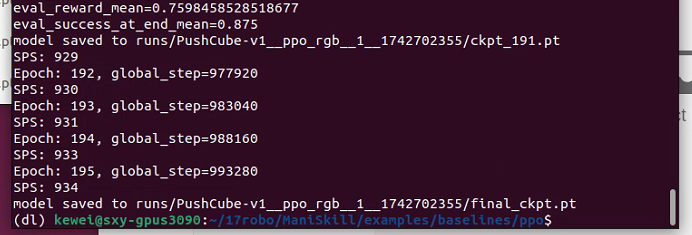

<think>我需要访问指定的文件并进行翻译。首先，我将查看是否可以直接访问要翻译的文件。</think>

Read file: /home/kewei/17robo/ManiSkill/examples/baselines/ppo/README.md

# 近端策略优化 (PPO)

PPO 强化学习算法的代码改编自 [CleanRL](https://github.com/vwxyzjn/cleanrl/) 和 [LeanRL](https://github.com/pytorch-labs/LeanRL/)。代码设计为单文件形式，易于理解和阅读，同时支持基于状态的强化学习和基于视觉的强化学习。

请注意，ManiSkill 仍处于测试阶段，因此我们尚未为所有预构建任务完成训练脚本（其中一些任务单靠RL本身就很难解决）。

官方基准结果可以通过运行 baselines.sh 文件中的脚本获得。结果已整理并发布在我们的 [wandb 报告](https://api.wandb.ai/links/stonet2000/k6lz966q) 中。

现在还有基于 LeanRL 的实验性支持，包括编译后的 PPO 和启用 CUDA Graphs。代码在 ppo_fast.py 中，你需要安装 [torchrl](https://github.com/pytorch/rl) 和 [tensordict](https://github.com/pytorch/tensordict/)：

```bash
pip install torchrl tensordict
```

## 基于状态的强化学习

以下是一些可以运行的命令示例，用于训练基于状态的策略以解决各种已经过轻微调整的 PPO 任务。最快的是 PushCube-v1 任务，在 GPU 上训练时间不到一分钟，而 PickCube-v1 任务在 GPU 上需要 2-5 分钟。

PPO 基准不保证适用于所有任务，因为有些任务尚未有密集奖励或尚未经过良好调整，或者仅仅是标准 PPO 难以解决。

```bash
python ppo.py --env_id="PushCube-v1" \
  --num_envs=2048 --update_epochs=8 --num_minibatches=32 \
  --total_timesteps=2_000_000 --eval_freq=10 --num-steps=20
```

要进行评估，可以运行：

```bash
python ppo.py --env_id="PushCube-v1" \
   --evaluate --checkpoint=path/to/model.pt \
   --num_eval_envs=1 --num-eval-steps=1000
```

请注意，使用 `--evaluate` 时，轨迹是从 GPU 模拟中保存的。为了使用 `maniskill.trajectory.replay_trajectory` 工具正确回放这些轨迹，对于某些任务，评估环境的数量必须固定为 `1`。这对于确保具有几何随机化的任务（例如 PickSingleYCB）的可重现性是必要的。其他没有几何随机化的任务（如 PushCube）可以增加评估环境的数量。

examples.sh 文件中包含一个完整的已测试命令列表，用于在许多任务上成功运行基于状态的 PPO。

基于状态的 PPO 基准脚本的运行结果在这里：https://api.wandb.ai/links/stonet2000/k6lz966q。

## 基于视觉 (RGB) 的强化学习

以下是一些轻度调整过的、用于训练基于图像的 PPO 策略的命令示例。最快的同样是 PushCube-v1，需要约 1-5 分钟，而 PickCube-v1 则需要 15-45 分钟。你需要根据 GPU 内存大小调整 `--num_envs` 参数，因为渲染视觉观察需要大量内存。下面的设置都应该使用不到 15GB 的 GPU 内存。examples.sh 文件中包含一个完整的已测试命令列表，用于在许多任务上成功运行基于视觉的 PPO。

```bash
python ppo_rgb.py --env_id="PushCube-v1" \
  --num_envs=256 --update_epochs=8 --num_minibatches=8 \
  --total_timesteps=1_000_000 --eval_freq=10 --num-steps=20
python ppo_rgb.py --env_id="PickCube-v1" \
  --num_envs=256 --update_epochs=8 --num_minibatches=8 \
  --total_timesteps=10_000_000
python ppo_rgb.py --env_id="AnymalC-Reach-v1" \
  --num_envs=256 --update_epochs=8 --num_minibatches=32 \
  --total_timesteps=10_000_000 --num-steps=200 --num-eval-steps=200 \
  --gamma=0.99 --gae_lambda=0.95
```




要评估已训练的策略，可以运行：

```bash
python ppo_rgb.py --env_id="PickCube-v1" \
  --evaluate --checkpoint=path/to/model.pt \
  --num_eval_envs=1 --num-eval-steps=1000
```

这将保存视频到 `path/to/test_videos`。


examples.sh 文件中包含一个完整的已测试命令列表，用于在许多任务上成功运行基于 RGB 的 PPO。

基于 RGB 的 PPO 基准脚本的运行结果在这里：https://api.wandb.ai/links/stonet2000/k6lz966q

## 基于视觉 (RGB+深度) 的强化学习

正在开发中

## 基于视觉 (点云) 的强化学习

正在开发中

## 回放评估轨迹

获取更好看的视频可能很有用。一个简单的方法是首先使用上面提供的评估脚本。它会保存一个与日期和时间同名的 .h5 和 .json 文件，然后你可以用不同的设置回放，如下所示：

```bash
python -m mani_skill.trajectory.replay_trajectory \
  --traj-path=path/to/trajectory.h5 --use-env-states --shader="rt-fast" \
  --save-video --allow-failure -o "none"
```

这将使用环境状态回放轨迹，打开光线追踪（还有"rt"，质量更高但速度更慢），并保存所有视频，包括失败的轨迹。

## 一些注意事项

- 使用 GPU 模拟进行评估（特别是对于随机化对象）有点棘手。我们建议阅读[我们的文档](https://maniskill.readthedocs.io/en/latest/user_guide/reinforcement_learning/baselines.html#evaluation)，了解如何使用 GPU 模拟公平地评估策略。
- 许多任务支持视觉观察，但我们尚未仔细验证任务的相机位置是否设置得合适，使得可以通过视觉观察解决某些任务。

## 引用

如果您使用此基准，请引用以下内容：

```
@article{DBLP:journals/corr/SchulmanWDRK17,
  author       = {John Schulman and
                  Filip Wolski and
                  Prafulla Dhariwal and
                  Alec Radford and
                  Oleg Klimov},
  title        = {Proximal Policy Optimization Algorithms},
  journal      = {CoRR},
  volume       = {abs/1707.06347},
  year         = {2017},
  url          = {http://arxiv.org/abs/1707.06347},
  eprinttype    = {arXiv},
  eprint       = {1707.06347},
  timestamp    = {Mon, 13 Aug 2018 16:47:34 +0200},
  biburl       = {https://dblp.org/rec/journals/corr/SchulmanWDRK17.bib},
  bibsource    = {dblp computer science bibliography, https://dblp.org}
}
```
