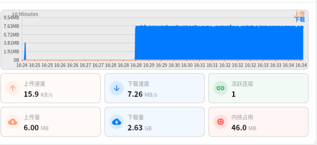

```bash
git clone https://github.com/hope5hope/SpatialVLA-Libero
```

然后按照代码里的运行即可。我整合了一版libero微调，非常方便

可以下载这个模型

```bash
git clone https://www.modelscope.cn/Koorye/spatialvla-4b-224-pt.git
```

modelscope还是比hf快很多

然后 修改模型路径即可


