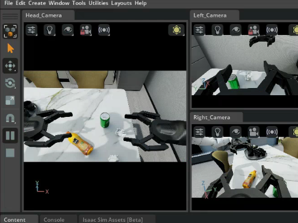

# 🤖 AI Hardware and Robotics Tutorial 🛠️

[中文](./README.md) | English

  

    <strong>A one-stop open-source tutorial library for learning robotics technology</strong>
  

    <a href="#-project-introduction">Introduction</a> •
    <a href="#-table-of-contents">Table of Contents</a> •
    <a href="#-learning-path-suggestion">Learning Path</a> •
    <a href="#-environment-requirements">Environment Requirements</a> •
    <a href="#-update-log">Update Log</a>
  

   

   

   

## 📖 Project Introduction

This repository collects and organizes tutorial materials related to AI hardware and robotics technology, covering various aspects such as robot simulation environment configuration, control algorithm implementation, hardware development, and hand-eye coordination. It is suitable for beginners and researchers in robotics technology to learn and reference.

💡 **Why choose this tutorial?**

- 📚 Comprehensive content: A systematic learning path from basic to advanced
- 🔧 Practical orientation: Contains a large number of practical code examples and application cases
- 🌐 Continuous updates: Tracks the latest technological developments and application trends
- 👨‍👩‍👧‍👦 Community support: Provides a platform for communication and problem-solving

## ✨ Latest Highlights

### 🍳 Smart Home Assistant

Our new home robot module can perform multiple kitchen tasks, including:

- Object recognition and grasping (vegetables, fruits, kitchen utensils, etc.)
- Environmental cleaning and organization (detailed tutorial to be implemented)

### 🧠 Reinforcement Learning Framework

The new reinforcement learning module supports:

- Implementation of multiple algorithms (PPO, SAC, TD3, etc.)
- Hybrid learning from imitation to reinforcement
- Performance evaluation and visualization tools

  <table>
    <tr>
      <td></td>
      <td></td>
      <td></td>
    </tr>
    <tr>
      <td>Robotic Arm Light and Shadow Rendering</td>
      <td>Getting Coffee</td>
      <td>Indoor Gaussian Splatting</td>
    </tr>
    <tr>
      <td></td>
      <td></td>
      <td></td>
    </tr>
    <tr>
      <td>Indoor Scene Segmentation</td>
      <td>Robotic Arm Banana Grasping</td>
      <td>Grasping Attention Visualization</td>
    </tr>
        <tr>
      <td></td>
      <td></td>
      <td></td>
    </tr>
    <tr>
      <td>Robotwin 1.0 Reproduction</td>
      <td>Lerobot Simulation Support</td>
      <td>OmniGibson</td>
    </tr>
    </tr>
        <tr>
      <td></td>
      <td></td>
      <td></td>
    </tr>
    <tr>
      <td>Zhiyuan Robot Multi-task 1</td>
      <td>Zhiyuan Robot Multi-task 2</td>
      <td>Zhiyuan Robot Multi-task 3</td>
    </tr>
        </tr>
        <tr>
      <td></td>
      <td></td>
      <td></td>
    </tr>
    <tr>
      <td>DiGua RDK-X5 connects to lerobot-so101 for teleoperation</td>
      <td>Zhiyuan Robot Keyboard Operation</td>
      <td>Zhiyuan Robot Trajectory Recording</td>
    </tr>
  </table>
  

## 🚀 Learning Path Suggestion

### Embodied AI Robot

1.  **Overview of Embodied Intelligence**
    *   Definition and Background
    *   Development History
    *   Application Areas

2.  **Robot Basics**
    *   Basic Concepts of Robotics
    *   Kinematics and Dynamics
    *   Sensors and Actuators
    *   Robot Hardware Selection
    *   Using DiGua Robot RDK and connecting to LeRobot SO101
    *   Ajiaxi Development Board Tutorial
    *   Circuit Design (todo)
    *   AutoCAD and Solidworks (todo)
    *   Communication Protocols (todo)
    *   ROS Basics (todo)

3.  **Computer Vision**
    *   Basics of Image Processing
    *   Object Detection and Recognition
    *   Image Segmentation
    *   Pose Estimation

4.  **Robot Control**
    *   Motion Planning
    *   Path Planning
    *   Control Algorithms

5.  **Deep and Reinforcement Learning in Embodied Scenarios**
    *   Reinforcement Learning

6.  **Hand-Eye Coordination**
    *   Hand-Eye Calibration
    *   Grasping and Manipulation

7.  **Simulation Environment Learning**
    *   Issac Sim/Issac Gym
    *   Pybullet
    *   Gazebo (todo)
    *   Genie-Sim

8.  **Cutting-edge Embodied Intelligence Projects (Reproduced)**
    *   Google Embodied Projects: RT-RT1, RT2, RTX (todo)
    *   OmniGibson
    *   BitVLA
    *   RoboBrain2.0 (todo)
    *   Aloha-ACT (todo)
    *   OpenVLA (todo)
    *   Octo (todo)
    *   AngGrasp (todo)
    *   Other paper reproductions and code

## 🔧 Environment Requirements

- Python 3.8+
- CUDA support (for 3D simulation rendering, some experiments can be run on CPU)
- ROS/ROS2 (optional, for actual robot control)
- MuJoCo (physics engine)
- Isaac Sim (NVIDIA advanced simulation platform)

Thanks to the following partners for their participation and contributions:

howe, Miles, Maimang, HAO

Thanks to the following partners for their translation contributions:

-   Chapters 1~3 Lune
-   Chapters 4~5 Liu Yuanyang
-   Chapters 6~7 Su Jiayu
-   Chapters 8~9 Liang Jianbin leoliang023

## 🌟 Learning Community

-   [Join the discussion group](#): Exchange experiences with other learners
-   [FAQ](#): View common questions and solutions
-   [Technical Sharing Sessions](#): Regular online technical sharing sessions

## 👨‍💻 Contribution Guide

Welcome to submit Pull Requests to contribute more tutorials and sample code! 👏

1.  Fork this repository
2.  Open a Pull Request

Please ensure that the submitted content is relevant to the repository's theme and follows the existing file organization structure.

## 📬 Contact Information

If you have any questions or suggestions, please contact us through the following ways:

-   💬 WeChat Official Account: datawhale
-   🌐 Website: [https://datawhale.club/home]
