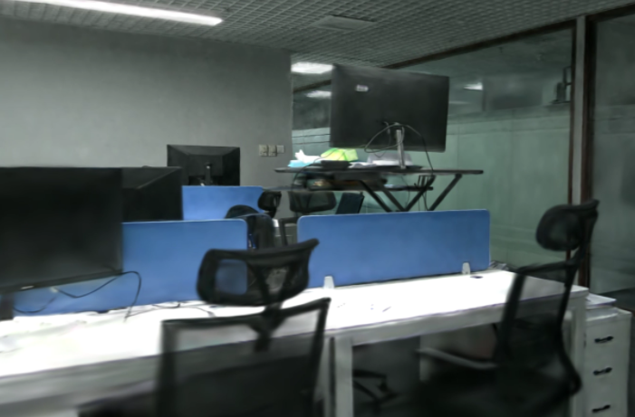
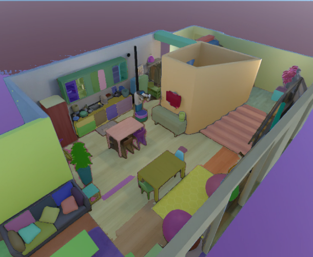

# 🤖 AI硬件与机器人技术教程 🛠️

<div align="center">
  

<p>
    <strong>一站式学习机器人技术的开源教程库</strong>
  </p>

<p>
    <a href="#项目简介">简介</a> •
    <a href="#内容目录">目录</a> •
    <a href="#学习路径建议">学习路径</a> •
    <a href="#环境要求">环境要求</a> •
    <a href="#更新日志">更新日志</a>
  </p>
</div>

<div align="center">
   
</div>
## 📖 项目简介

本仓库收集整理了AI硬件与机器人技术相关的教程资料，涵盖机器人仿真环境配置、控制算法实现、硬件开发、手眼协调等多个方面。适合机器人技术初学者和研究人员学习参考。

💡 **为什么选择本教程？**

- 📚 内容全面：从基础到进阶，系统化学习路径
- 🔧 实用导向：包含大量实际代码示例和应用案例
- 🌐 持续更新：跟踪最新技术发展和应用趋势
- 👨‍👩‍👧‍👦 社区支持：提供交流和问题解答平台

## 📋 内容目录

### 1. 🎮 [机器人仿真](01-机器人仿真/)

- **🛠️ 环境配置教程**：包含DISCOVERSE、ManiSkill、Issac-sim、GR00T等主流仿真平台的环境搭建指南
- **🤖 仿真模型资源**：提供常用机器人模型和场景资源
- **🏆 仿真挑战赛**：机器人仿真相关竞赛资料

### 2. ⚙️ [机器人控制](02-机器人控制/)

- **📊 PID控制算法**：详细介绍PID控制原理及代码实现
- **📐 运动学与动力学**：机器人运动控制基础理论
- **🛣️ 轨迹规划**：机器人路径生成与优化方法

### 3. 💻 [机器人硬件](03-机器人硬件/)

- **🔌 PCB设计**：机器人电路板设计指南
- **🧠 开发板教程**：RDK X5等开发板使用说明
- **📡 传感器应用**：常用传感器接口与数据处理

### 4. 👁️ [手眼协调](04-手眼协调/)

- **📏 手眼标定**：相机-机械臂坐标系转换方法
- **🎯 视觉伺服**：基于视觉反馈的机器人控制

### 5. 🧠 [机器人学习](05-机器人学习/)

- **🎮 强化学习**：机器人强化学习算法与应用
- **👨‍🏫 模仿学习**：从人类示范中学习机器人技能

### 6. 🎬 [示例与演示](06-示例与演示/)

- **🚀 实际应用案例**：各类机器人应用示例代码
- **📹 演示视频**：教程相关演示资料

## ✨ 最新亮点

### 🍳 智能家务助手

我们新增的家务机器人模块可实现多项厨房任务，包括：

- 🥕 物体识别与抓取（蔬菜、水果、厨具等）
  
  <!-- - 🔪 基础烹饪操作（切菜、搅拌、翻炒） -->

- 🧹 环境清理与整理（详细教程待实现）

### 🧠 强化学习框架

全新的强化学习模块支持：

- 📈 多种算法实现（PPO、SAC、TD3等）
- 🔄 从模仿到强化的混合学习
- 📊 性能评估与可视化工具

<div align="center">
  <table>
    <tr>
      <td></td>
      <td></td>
      <td></td>
    </tr>
    <tr>
      <td>机械臂光影渲染</td>
      <td>取咖啡</td>
      <td>室内高斯泼溅</td>
    </tr>
    <tr>
      <td></td>
      <td></td>
      <td></td>
    </tr>
    <tr>
      <td>室内场景分割</td>
      <td>机械臂香蕉抓取</td>
      <td>抓取注意力可视化</td>
    </tr>
  </table>
  </div>

## 🚀 学习路径建议

<div align="center">
  
</div>

1. 🎮 从「[机器人仿真](01-机器人仿真/)」开始，搭建基础实验环境
2. ⚙️ 学习「[机器人控制](02-机器人控制/)」中的基本算法，掌握控制原理
3. 💻 结合「[机器人硬件](03-机器人硬件/)」了解实际系统实现方法
4. 👁️ 深入「[手眼协调](04-手眼协调/)」和「[机器人学习](05-机器人学习/)」进阶主题
5. 🎬 参考「[示例与演示](06-示例与演示/)」进行实际项目实践

## 🔧 环境要求

- 🐍 Python 3.8+
- 🖥️ CUDA支持（用于3D仿真渲染）
- 🤖 ROS/ROS2（可选，用于实际机器人控制）
- 🎮 MuJoCo（物理引擎）
- 🖼️ Isaac Sim（NVIDIA高级仿真平台）

## 📝 使用方法

每个教程目录下包含独立的说明文档，请参照各自文档进行环境配置和代码运行。

```bash
# 克隆仓库
git clone https://github.com/yourusername/ai-hardware-robotics.git
cd ai-hardware-robotics

# 查看各部分教程
ls 01-机器人仿真/
ls 02-机器人控制/
```

## 🌟 学习社区

- 💬 [加入讨论组](#)：与其他学习者交流经验
- ❓ [常见问题解答](#)：查看常见问题及解决方案
- 📣 [技术分享会](#)：定期举办线上技术分享

## 📅 更新日志

### 🔥 2025年3月最新更新

- 🏆 **重磅发布：家务机器人仿真环境**
  
  - 🍳 完整厨房场景与互动物品库
  - 🤖 支持模仿学习的人类示范数据集
  - 🧪 多任务强化学习训练框架

- 🚀 **仿真环境增强**
  
  - 📦 ManiSkill3.0详细配置教程与示例
  - 🔧 NVIDIA Isaac Sim完整安装与使用指南
  - 🌐 DISCOVERSE高质量渲染环境配置
  - GR00T配置和教程notebook

- 🧠 **机器人学习框架**
  
  - 🎯 物体抓取与操作强化学习算法
  - 🎮 视觉引导的机械臂控制
  - 📊 多模态感知与决策集成

- 💻 **代码库与示例**
  
  - ⚙️ PID控制算法优化与应用扩展
  - 📱 RDK X5开发板完整项目实例
  - 🔌 传感器集成与数据处理示例

### 2025年2月

- 🧪 添加手眼标定相关教程
- 🛠️ 增加RDK X5开发板使用指南
- 📊 PID控制算法可视化工具
- 🔍 Isaac Sim环境初步配置

### 2024年12月

- 🤖 收集整理机器人仿真资源
- 📊 初步规划教程内容
- 🎮 ManiSkill基础环境搭建
- 📝 仿真配置文档编写

## 👨‍💻 贡献指南

欢迎提交Pull Request贡献更多教程和示例代码！👏

1. Fork本仓库
2. 开启一个Pull Request

请确保提交的内容与仓库主题相关，并遵循现有的文件组织结构。

## 📬 联系方式

有任何问题或建议，请通过以下方式联系我们：

<!-- - 📧 邮箱：[your-email@example.com] -->

- 💬 微信公众号：datawhale
- 🌐 网站：[https://datawhale.club/home]

## 📜 许可证

本项目采用 MIT 许可证 - 详情请参阅 [LICENSE](LICENSE) 文件