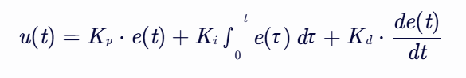
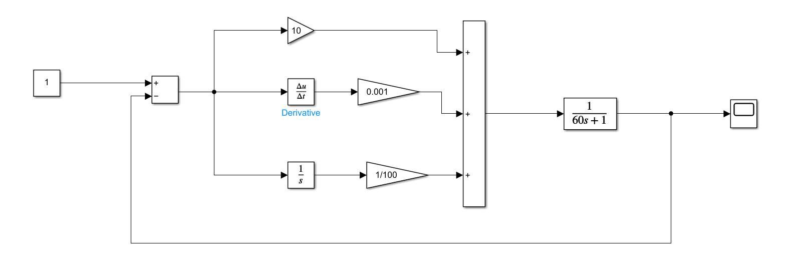
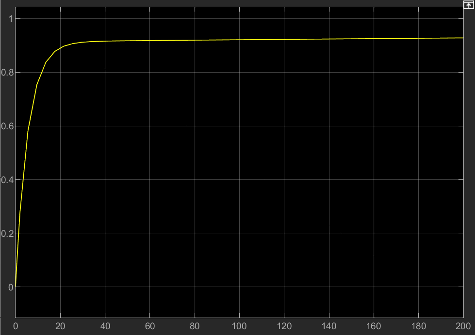
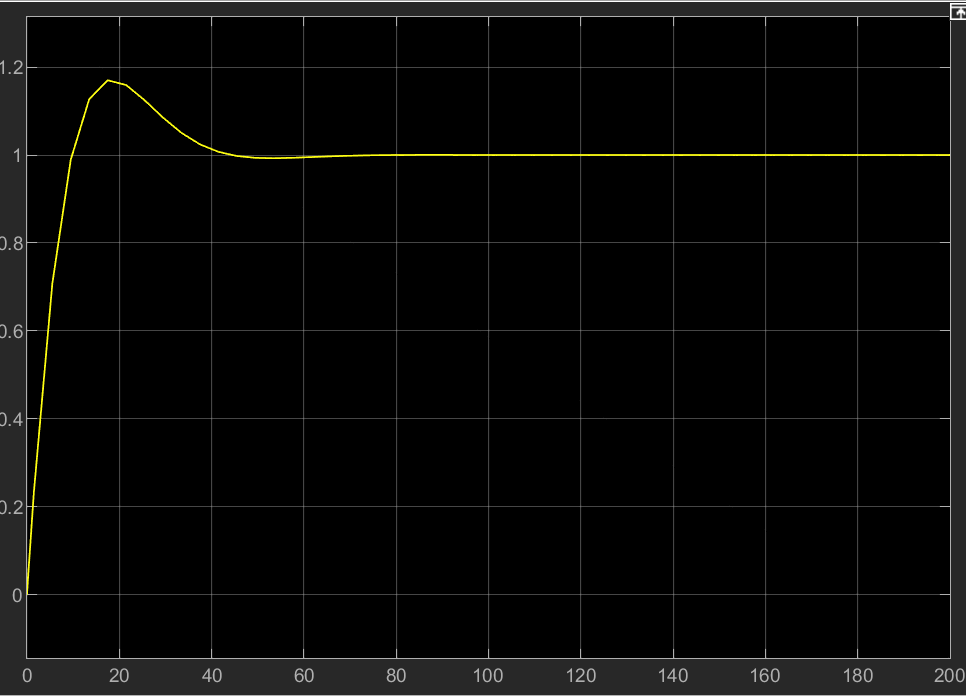
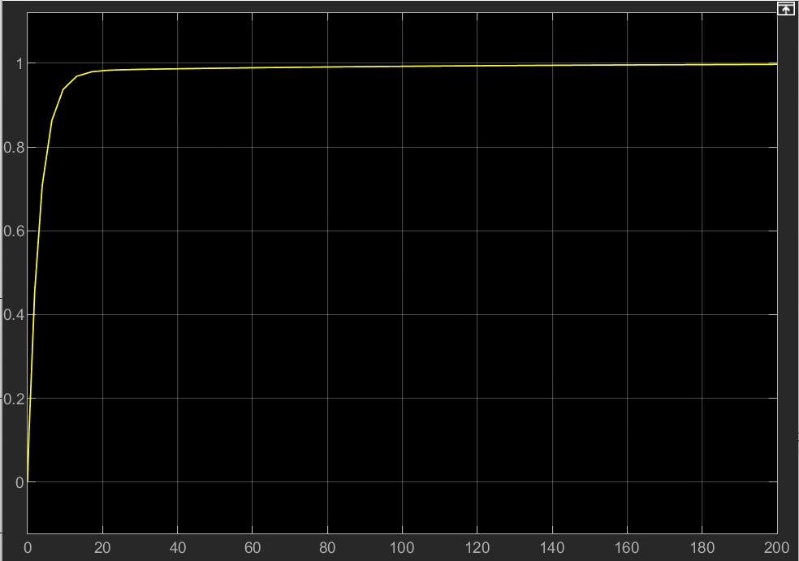
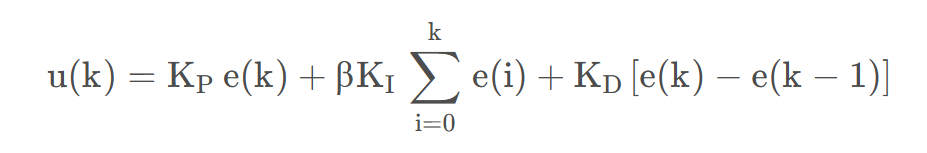
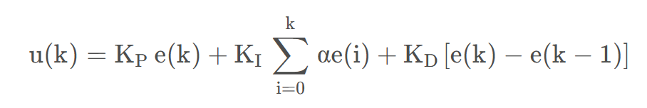
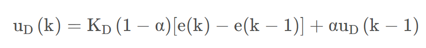

# \[PID Control Algorithm and Code Implementation]

## Author

### \[Smart Hardware] \[Leng Xiao Mo]

### \[[1412195676@qq.com](mailto:1412195676@qq.com)]

## Date

\[December 2024]

## Abstract

* The PID control algorithm is one of the most commonly used control algorithms in industrial automation.
* PID adjusts the control input based on the error between the actual output and the desired output, utilizing the proportional (P), integral (I), and derivative (D) components of the error to achieve precise control of the system.

## Working Principle

The PID controller calculates the control input using the following three basic components:

* **Proportional (P):** Directly amplifies the error in proportion, which can quickly reduce the error but may lead to system instability.
* **Integral (I):** Integrates the error over time to eliminate steady-state error but may slow down the system's response.
* **Derivative (D):** Predicts the error's rate of change, allowing for early adjustments to improve the system's response speed and stability.
* **e(t):** Current error, which is the difference between the desired output and the actual output.
* **K\_p:** Proportional coefficient.
* **K\_i:** Integral coefficient.
* **K\_d:** Derivative coefficient.

### Implementation Steps:

1. **Calculate the error:** Find the difference between the actual output and the desired output.
2. **Proportional term:** Compute the proportional term based on the proportional coefficient and the error.
3. **Integral term:** Integrate the error and compute the integral term based on the integral coefficient.
4. **Derivative term:** Compute the derivative of the error and calculate the derivative term based on the derivative coefficient.
5. **Calculate the control input:** Sum the proportional, integral, and derivative terms to get the control input.
6. **Apply the control input:** Apply the control input to the controlled system.

Overall formula: 

---

### Code Example (Python)

Here is a simple Python implementation of the PID control algorithm:

```python
class PID:
    # Initialize the PID controller
    def __init__(self, Kp, Ki, Kd, setpoint=0, sample_time=0.01):
        self.Kp = Kp
        self.Ki = Ki
        self.Kd = Kd
        self.setpoint = setpoint
        self.sample_time = sample_time

        self.prev_error = 0
        self.integral = 0

    # PID calculation process
    def update(self, measured_value):
        error = self.setpoint - measured_value  # Calculate the error
        self.integral += error * self.sample_time  # Integral term
        derivative = (error - self.prev_error) / self.sample_time  # Derivative term

        output = self.Kp * error + self.Ki * self.integral + self.Kd * derivative  # Control input
        self.prev_error = error  # Save the error

        return output


pid = PID(Kp=1.0, Ki=0.1, Kd=0.01, setpoint=100)
measured_value = 90  # Example measured value
control_input = pid.update(measured_value)

print(f"Control Input: {control_input}")
```

### Code Example (C Language)

```c
void pid_init(pid_type_def *pid, uint8_t mode, float max_output, float max_iout, const float PID[3]) {
    pid->mode = mode;
    pid->max_output = max_output;
    pid->max_ioutput = max_iout;
    pid->Dbuf[0] = pid->Dbuf[1] = pid->Dbuf[2];
    pid->error[0] = pid->error[1] = pid->error[2] = pid->pout = pid->iout = pid->dout = 0.0f;
}

float PID_calc(pid_type_def *pid, float ref, float set, float PID[3]) {
    pid->kp = PID[0];
    pid->ki = PID[1];
    pid->kd = PID[2];

    pid->error[2] = pid->error[1];
    pid->error[1] = pid->error[0];

    pid->set = set;
    pid->cur = ref;

    pid->error[0] = set - ref;

    if (pid->mode == PID_POSITION) {
        pid->pout = pid->kp * pid->error[0];
        pid->iout += pid->ki * pid->error[0];
        pid->Dbuf[2] = pid->Dbuf[1];
        pid->Dbuf[1] = pid->Dbuf[0];
        pid->Dbuf[0] = pid->error[0] - pid->error[1];
        if (pid->iout > pid->max_ioutput) {
            pid->iout = pid->max_ioutput;
        } else if (pid->iout < -pid->max_ioutput) {
            pid->iout = -pid->max_ioutput;
        }
        if (pid->iout * pid->error[0] < 0) {
            pid->iout = 0;
        }
        if (pid->cur > 0.707 * pid->set || pid->cur < 0.707 * pid->set) {
            pid->dout = pid->kd * pid->Dbuf[0];
        } else {
            pid->dout = 0;
        }
        pid->output = pid->pout + pid->iout + pid->dout;
        if (pid->output > pid->max_output) {
            pid->output = pid->max_output;
        }
    }

    return pid->output;
}
```

## Experience Sharing

* In general, we access the effect of the PID algorithm through the stability and response speed of the waveform.
* Typically, we can first set a relatively large proportional coefficient, and then gradually decrease it until the system response becomes smooth.
* The integral term eliminates steady-state errors but may cause overshoot but can slow down the system's response.
* The function of the derivative term is to predict the changing trend of the error, so as to make adjustments in advance and improve the response speed and stability of the system.

## Analysis Example (MatLab-Simulink)

* This is the Simulink simulation graph and its effect when P = 10, I = 0.001, D = 0.01, with a sampling period of T = 200.
  

* It shows a steady-state error; increasing I will eliminate the steady-state error.
  

* After increasing I, an overshoot occurs, and we need to increase D.
  

* The best result looks like this:
  

# Optimization and Other PID Calculations

### Here's a helpful mnemonic for tuning (Chinese):

```
            参数整定找最佳， 从小到大顺序查。

            先是比例后积分， 最后再把微分加。

            曲线振荡很频繁， 比例度盘要放大。

            曲线漂浮绕大弯， 比例度盘往小扳。

            曲线偏离回复慢， 积分时间往下降。

            曲线波动周期长， 积分时间再加长。

            曲线振荡频率快， 先把微分降下来。

            动差大来波动慢， 微分时间应加长。

            理想曲线两个波， 前高后低四比一。

            一看二调多分析， 调节质量不会低。

```

1. **Tuning sequence**: To find the optimal parameters, adjust them in ascending order—starting with proportional, then integral, and finally derivative.  

2. **Proportional adjustment**:  
   - If the curve oscillates frequently, increase the proportional band.  
   - If the curve drifts in large loops, decrease the proportional band.  

3. **Integral adjustment**:  
   - If the curve deviates and recovers slowly, reduce the integral time.  
   - If the curve fluctuates with long cycles, increase the integral time.  

4. **Derivative adjustment**:  
   - If the curve oscillates at high frequency, first reduce the derivative time.  
   - If there is large dynamic error with slow fluctuations, increase the derivative time.  

5. **Ideal outcome**: The optimal curve should show two waves, with the first peak higher than the second in a 4:1 ratio. By observing, adjusting, and analyzing repeatedly, high control quality can be achieved.

### Additional

* In general, the position PID control algorithm can stabilize most control systems, but depending on the application, there are different optimization algorithms.

* **1. Integral Separation PID**



* **2. Variable-Speed Integral PID Control**



* **3. Incomplete Derivative PID Control**



