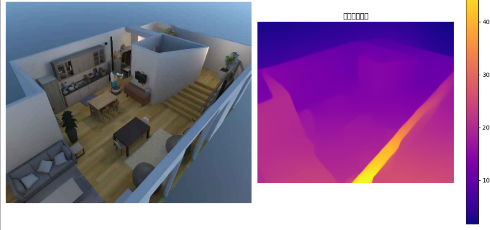
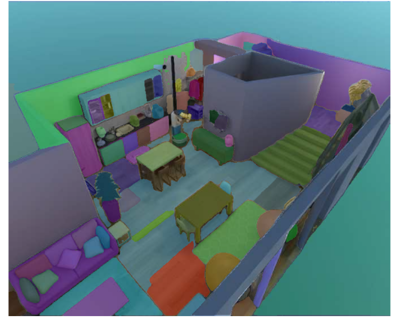

### Preparation：sam_vit_h_4b8939.pth download

This file contains the pre-trained model weights for the Segment Anything Model (SAM) released by Meta AI, specifically the ViT-H (Huge) version. It is the largest and most effective of the three sizes provided by SAM.

```
# sam_vit_h_4b8939.pth is the weights for the ViT-H SAM model.
# The file size is approximately 2.4 GB. Please ensure sufficient disk space and a stable network connection.
wget https://dl.fbaipublicfiles.com/segment_anything/sam_vit_h_4b8939.pth
pip install git+https://github.com/facebookresearch/segment-anything.git
```

### 1. Segment Anything Model (SAM) Principles

#### 1. Core idea: From "what to divide" to "everything to divide"

Before SAM, image segmentation models were typically “expert models” that were trained to segment specific categories like “person,” “car,” “cat,” etc. If you tried to segment an object they hadn’t seen during training, they would typically fail.

The core idea behind SAM is to create a **universal, promptable segmentation model**. It doesn't care what the object is, only where it is. Its goal is to accurately segment the corresponding object or region given any form of user prompt (point, box, text, etc.). This is called "promptable segmentation."

#### 2. SAM's three core components

The SAM architecture can be viewed as consisting of three components that work together to achieve efficient and flexible segmentation:

- **Image Encoder**
  - **Function**: This is the heaviest part of SAM, responsible for "understanding" the entire image. It uses a very powerful **Vision Transformer (ViT)** model (ViT-H in the model you downloaded).
  
  - **Process**: When an image is input, the image encoder performs complex calculations on it to convert it into a digital representation (called feature embedding) that contains rich spatial and semantic information. This process only needs to be performed once for each image, and the result can be reused.
  
  - **Analogy**: Think of it like an artist thoroughly observing and conceiving a scene before painting, keeping all the details and relationships in mind.
  
- **Prompt Encoder**
  - **Function**: Responsible for converting various user prompts into numerical representations that the model can understand (also feature embedding).
  
  - **Supported prompt types**：
    - **Points**: Click one or more points on an object (foreground/background).
    - **Bounding Boxes**: Draw a rough bounding box around an object.
    
    - **Masks**: Provide a coarse segmentation region.
    
    - **Text**: While the original SAM paper focused on geometric cues, its architecture can be extended to understand textual cues by combining it with other models such as CLIP.
    
  - **Analogy**: If the image encoder is an artist, the prompt encoder is the translator, which translates the simple instructions you give using "dots" or "boxes" into a language that the artist can understand.
  
- **Mask Decoder**
  - **Purpose**: This is the key to SAM's real-time interactivity. It is extremely lightweight and efficient.
  - **Process**: The decoder receives the "brain memory" (image features) from the **Image Encoder** and the "instructions" (cue features) from the **Hint Encoder**, and then quickly computes the final, high-quality segmentation mask.
  
  - **Benefit**: Because the decoder is so fast (on the order of milliseconds), it allows you to see the segmentation results change in real time as you move your mouse or adjust a box on the image, providing an excellent interactive experience.
  
  - **Analogy**: The artist (image encoder) has already conceived the entire image. When you (the user) say "I want this cup" through the translator (cue encoder), the artist (mask decoder) can almost instantly use a brush to accurately outline the cup.

#### 3. Training Process: The Power of Scale

SAM's powerful versatility stems from its massive amount of training data. Meta AI created a dataset called **SA-1B**, which contains **11 million** images and over **1 billion** high-quality segmentation masks. By training on this massive dataset, SAM learned to recognize and segment a wide variety of previously unseen objects and structures, achieving the ability to "segment everything."

### 2. Monocular Depth Estimation Principle

#### 1. Core Problem: Recovering 3D Information from 2D Images

A typical photo is a projection of the three-dimensional world onto a two-dimensional plane. In this process, a crucial dimension—**depth (i.e., the object's distance from the camera)**—is lost. Monocular depth estimation uses artificial intelligence to infer this missing depth information from a **single** RGB image.

#### 2. How AI "sees" depth: Mimicking the human brain's visual cues

The human brain naturally perceives depth in 2D images because it uses a variety of visual cues. Deep learning models learn these cues to accomplish their tasks:

- **Relative Size**: Objects of the same type appear smaller in the field of view, generally farther away.
- **Occlusion**: If object A blocks object B, then A is closer than B.

- **Texture Gradient**: Surface textures on distant objects (such as grass and brick walls) appear denser and blurrier.

- **Linear Perspective**: Parallel lines (such as roads and railroad tracks) converge in the distance.

- **Shading and Shadows**: The shadows cast by light on objects can reveal their shapes and relative positions.

#### 3. Implementation methods of deep learning models

Currently, mainstream depth estimation models typically use **supervised learning** and an **encoder-decoder architecture**.

- **Training data**：The model needs to be trained on a large dataset. This dataset contains pairs of **RGB images** and their corresponding **ground-truth depth maps**. These ground-truth depth maps are usually collected using specialized equipment such as LiDAR and stereo cameras.

- **Encoder-Decoder Architecture**：
  - **Encoder**：Similar to SAM, the encoder extracts features from the input RGB image. It acts like an information funnel, compressing the image layer by layer while extracting a variety of features, from low-level features (edges, corners) to high-level features (object parts, textures). It is through this process that the model learns to recognize the various depth cues mentioned above.
  
  - **Decoder**：The decoder performs the opposite function of the encoder. It takes the condensed features extracted by the encoder and upscales them layer by layer, ultimately "drawing" a depth map of the same size as the original image. Each decoder layer incorporates features from the corresponding encoder layer, ensuring that the final depth map is both rich in detail and has accurate global structure.
  
- **The DPT model used in our code**：
  - In the previous code, we used the `Intel/dpt-large` model. **DPT** stands for **Dense Prediction Transformer**.
  
  - Its unique feature is that its encoder utilizes the powerful **Vision Transformer (ViT)**. Compared to traditional convolutional networks (CNNs), the Transformer is better at capturing **global dependencies** within images. For example, it better understands the perspective structure of a scene, enabling more accurate depth estimation of distant objects. This makes DPT an exceptional performer for depth estimation.

#### 4. Understanding Output: Relative Depth vs. Absolute Depth

It is important to note that most models for depth estimation from a single image output a **relative depth map**.

- **What is relative depth?**：In the output depth map, the magnitude (or color) of the pixel values only indicates "distance." For example, a point with a pixel value of 0.8 is farther than a point with a value of 0.2, but you can't directly say it's 10 meters farther. The depth of the entire scene is normalized to a fixed range (e.g., 0 to 1).

- **Why not absolute depth?**：It's impossible to determine the true scale of a scene from a single image. A photo of a small house and a photo of a large house might look exactly the same. Obtaining absolute depth in meters typically requires additional scale information or hardware like stereo cameras.

Code:

```python
import torch
import numpy as np
from PIL import Image
import matplotlib.pyplot as plt
import os
import time

# --- Transformers Imports for Depth Estimation ---
from transformers import DPTImageProcessor, DPTForDepthEstimation

# --- SAM Imports ---
from segment_anything import sam_model_registry, SamAutomaticMaskGenerator

# --- Device Setup ---
device = "cuda" if torch.cuda.is_available() else "cpu"
print(f"Device used: {device}")
torch_dtype = torch.float16 if torch.cuda.is_available() else torch.float32

# --- Global Variables for Models (Load once) ---
sam_model_instance = None # Changed name for clarity
depth_model = None
depth_processor = None

# --------------------------------------------------------------------------
# Model Loading Functions
# --------------------------------------------------------------------------

def load_sam_for_automatic_maskgen(model_path, model_type="vit_h"):
    """
    Loads a SAM model for use with SamAutomaticMaskGenerator.
    Returns a SamAutomaticMaskGenerator instance if successful, otherwise returns None.
    """
    global sam_model_instance
    if sam_model_instance is None:
        print(f"Loading SAM model from {model_path} (type: {model_type})...")
        if not os.path.exists(model_path):
            print(f"ERROR: SAM model file not found at {model_path}")
            return None
        try:
            sam_model_instance = sam_model_registry[model_type](checkpoint=model_path)
            sam_model_instance.to(device=device)
            print("SAM model loaded successfully.")
        except Exception as e:
            print(f"Error loading SAM model: {e}")
            sam_model_instance = None
            return None

    if sam_model_instance:
        try:
            mask_generator = SamAutomaticMaskGenerator(sam_model_instance)
            print("SamAutomaticMaskGenerator Create Success。")
            return mask_generator
        except Exception as e:
            print(f"Error creating SamAutomaticMaskGenerator: {e}")
            return None
    return None

def load_depth_estimation_model(model_name="Intel/dpt-large"):
    """
    Loads a depth estimation model and processor (e.g. DPT).
    Returns True if successful, False otherwise.
    """
    global depth_model, depth_processor
    if depth_model is None or depth_processor is None:
        print(f"Loading depth estimation model ({model_name})...")
        try:
            depth_processor = DPTImageProcessor.from_pretrained(model_name)
            depth_model = DPTForDepthEstimation.from_pretrained(model_name, torch_dtype=torch_dtype)
            depth_model.to(device)
            depth_model.eval() # Set to evaluation mode
            print("The depth estimation model was loaded successfully.")
            return True
        except Exception as e:
            print(f"Error loading depth estimation model: {e}")
            depth_model = None
            depth_processor = None
            return False
    return True

# --------------------------------------------------------------------------
# Perception Functions
# --------------------------------------------------------------------------

def segment_image_fully_sam(image_np, mask_generator):
    """
    Use SAM AutomaticMaskGenerator to segment the entire image.
    (The function is the same as the previous version)
    """
    if mask_generator is None:
        print("ERROR: SamAutomaticMaskGenerator not loaded.")
        return None
    try:
        print("SAM: Generating mask for entire image...")
        if image_np.shape[2] != 3:
            print(f"Error: Image needs to be 3-channel RGB, but got {image_np.shape[2]} channels.")
            return None
        if image_np.dtype != np.uint8:
            print(f"Warning: Expected image data type np.uint8, but got {image_np.dtype}. Trying to convert...")
            image_np = image_np.astype(np.uint8)
        masks = mask_generator.generate(image_np)
        print(f"SAM: {len(masks)} masks are generated.")
        if not masks:
            print("SAM: No mask generated.")
            return None
        return masks
    except Exception as e:
        print(f"An error occurred during SAM full image segmentation.: {e}")
        return None

def estimate_depth_from_rgb(image_pil):
    """
   Depth estimation from RGB images.

    Args:
        image_pil (PIL.Image): Input RGB image.

    Returns:
        np.ndarray or None: The predicted depth map (H, W), or None on error.
    """
    if depth_model is None or depth_processor is None:
        print("ERROR: Depth estimation model not loaded.")
        return None

    try:
        print("Depth Estimation: Processing images and predicting depth...")
        inputs = depth_processor(images=image_pil, return_tensors="pt").to(device, dtype=torch_dtype)
        with torch.no_grad():
            outputs = depth_model(**inputs)
            predicted_depth = outputs.predicted_depth

        # Interpolate the depth map to the original image size
        prediction = torch.nn.functional.interpolate(
            predicted_depth.unsqueeze(1),
            size=image_pil.size[::-1], # (height, width)
            mode="bicubic",
            align_corners=False,
        )
        prediction = prediction.squeeze().cpu().numpy()
        print("Depth estimation is complete.")
        return prediction
    except Exception as e:
        print(f"Error during depth estimation: {e}")
        return None

# --------------------------------------------------------------------------
# Visualization Functions
# --------------------------------------------------------------------------

def show_sam_anns(anns, image_np, output_filename="sam_segmented_output.png"):
    """
    Displays annotations (masks) generated by SamAutomaticMaskGenerator on the image.
    (The function is similar to the previous version, with the addition of a save function)
    """
    if not anns:
        print("There are no SAM comments to display.")
        plt.figure(figsize=(10, 8))
        plt.imshow(image_np)
        plt.title("Original image (without SAM mask)")
        plt.axis('off')
        plt.savefig(output_filename.replace(".png", "_no_anns.png"))
        plt.show()
        return

    plt.figure(figsize=(12, 10))
    plt.imshow(image_np)
    ax = plt.gca()
    ax.set_autoscale_on(False)
    sorted_anns = sorted(anns, key=(lambda x: x['area']), reverse=True)
    img_overlay = np.ones((sorted_anns[0]['segmentation'].shape[0], sorted_anns[0]['segmentation'].shape[1], 4))
    img_overlay[:,:,3] = 0
    for ann in sorted_anns:
        m = ann['segmentation']
        color_mask = np.concatenate([np.random.random(3), [0.35]])
        img_overlay[m] = color_mask
    ax.imshow(img_overlay)
    plt.title("SAM Full image segmentation results")
    plt.axis('off')
    plt.savefig(output_filename)
    print(f"SAM segmentation results have been saved to {output_filename}")
    plt.show()

def show_depth_map(depth_map_np, original_image_np, output_filename="depth_estimation_output.png"):
    """
    Displays the estimated depth map.

    Args:
        depth_map_np (np.ndarray): Estimated depth map (H, W).
        original_image_np (np.ndarray): Raw RGB image (H, W, 3), for side-by-side display.
        output_filename (str): The file name to save the depth map visualization result.
    """
    if depth_map_np is None:
        print("There is no depth map to display.")
        return

    plt.figure(figsize=(12, 6)) # Resize to fit both subplots

    plt.subplot(1, 2, 1)
    plt.imshow(original_image_np)
    plt.title("Original RGB image")
    plt.axis('off')

    plt.subplot(1, 2, 2)
    plt.imshow(depth_map_np, cmap="plasma") # Use a colormap such as 'plasma' or 'viridis'
    plt.colorbar(label="Relative Depth")
    plt.title("Estimated depth map")
    plt.axis('off')

    plt.tight_layout()
    plt.savefig(output_filename)
    print(f"The depth map visualization results have been saved to {output_filename}")
    plt.show()

# --------------------------------------------------------------------------
# Main Pipeline Function
# --------------------------------------------------------------------------

def run_perception_pipeline(
    rgb_image_path,
    sam_model_path=None, # SAM model path becomes optional
    sam_model_type="vit_h",
    depth_model_name="Intel/dpt-large",
    run_sam_segmentation=False, # Controls whether SAM runs
    run_depth_estimation=True,  # Controls whether depth estimation is performed
    show_visuals=True
):
    """
    Run the perception pipeline, optionally performing SAM segmentation and/or depth estimation.
    """
    start_time = time.time()

    # --- Loading input data ---
    print("--- Loading data ---")
    if not os.path.exists(rgb_image_path):
        print(f"Error: RGB image not found at {rgb_image_path}")
        return None
    try:
        image_pil = Image.open(rgb_image_path).convert("RGB")
        image_np = np.array(image_pil)
        print(f"Loaded RGB image: {image_np.shape}, type: {image_np.dtype}")
    except Exception as e:
        print(f"Error loading image: {e}")
        return None

    # --- Depth Estimation ---
    estimated_depth_map = None
    if run_depth_estimation:
        print("\n--- Run depth estimation ---")
        if not load_depth_estimation_model(depth_model_name):
            print("Depth estimation model loading failed, skipping depth estimation.")
        else:
            estimated_depth_map = estimate_depth_from_rgb(image_pil)
            if estimated_depth_map is not None and show_visuals:
                show_depth_map(estimated_depth_map, image_np, output_filename=f"{os.path.splitext(os.path.basename(rgb_image_path))[0]}_depth.png")

    # --- SAM full image segmentation ---
    sam_masks = None
    if run_sam_segmentation:
        print("\n--- Run SAM full image segmentation ---")
        if sam_model_path is None:
            print("ERROR: SAM model path not provided, skipping SAM splitting.")
        else:
            sam_mask_generator = load_sam_for_automatic_maskgen(sam_model_path, sam_model_type)
            if sam_mask_generator is None:
                print("SAM MaskGenerator Load failed, skipping SAM split.")
            else:
                sam_masks = segment_image_fully_sam(image_np, sam_mask_generator)
                if sam_masks is not None and show_visuals:
                    show_sam_anns(sam_masks, image_np, output_filename=f"{os.path.splitext(os.path.basename(rgb_image_path))[0]}_sam_seg.png")

    end_time = time.time()
    print(f"\nThe sensing process was completed in {end_time - start_time:.2f} seconds.")

    results = {}
    if estimated_depth_map is not None:
        results["depth_map"] = estimated_depth_map
    if sam_masks is not None:
        results["sam_masks"] = sam_masks
    return results if results else None

# --- Example Usage (for testing this script directly) ---
if __name__ == "__main__":
    print("Run the Perception Process example...")

    # --- Configuration ---
    rgb_path = "image_d61af3.jpg" # Make sure this image file exists
    sam_ckpt_path = "/home/kewei/17robo/01mydemo/01ckpt/sam_vit_h_4b8939.pth" # Your SAM model path

    # Check if a file exists
    if not os.path.exists(rgb_path):
        print(f"Error: Sample image '{rgb_path}' not found. Please place it in the script directory or update the path.")
    else:
        # Example 1: Run only depth estimation
        print("\n--- Example 1: Run only depth estimation ---")
        results_depth_only = run_perception_pipeline(
            rgb_image_path=rgb_path,
            run_depth_estimation=True,
            run_sam_segmentation=False, # Turn off SAM
            show_visuals=True
        )
        if results_depth_only and "depth_map" in results_depth_only:
            print(f"Depth estimation is successful. Depth map shape: {results_depth_only['depth_map'].shape}")
        else:
            print("Depth estimation failed or was not run.")

        # Example 2: Run depth estimation and SAM segmentation (make sure SAM checkpoint path is valid)
        if os.path.exists(sam_ckpt_path):
            print("\n--- Example 2: Running depth estimation and SAM segmentation ---")
            results_both = run_perception_pipeline(
                rgb_image_path=rgb_path,
                sam_model_path=sam_ckpt_path,
                run_depth_estimation=True,
                run_sam_segmentation=True,
                show_visuals=True
            )
            if results_both:
                if "depth_map" in results_both:
                    print(f"Depth estimation is successful. Depth map shape:{results_both['depth_map'].shape}")
                if "sam_masks" in results_both:
                     print(f"SAM segmentation was successful. {len(results_both['sam_masks'])} masks were generated.")
            else:
                print("Depth estimation and/or SAM segmentation failed or did not run.")
        else:
            print(f"\n Warning: SAM checkpoint '{sam_ckpt_path}' not found. Skipping running SAM split example.")

        # Example 3: Run only SAM split (make sure SAM checkpoint path is valid)
        if os.path.exists(sam_ckpt_path):
            print("\n--- Example 3: Run only SAM segmentation ---")
            results_sam_only = run_perception_pipeline(
                rgb_image_path=rgb_path,
                sam_model_path=sam_ckpt_path,
                run_depth_estimation=False, # Turn off depth estimation
                run_sam_segmentation=True,
                show_visuals=True
            )
            if results_sam_only and "sam_masks" in results_sam_only:
                print(f"SAM segmentation was successful. {len(results_sam_only['sam_masks'])} masks were generated.")
            else:
                print("SAM split failed or did not run.")
        else:
            print(f"\n Warning: SAM checkpoint '{sam_ckpt_path}' not found. Skipping examples that only run SAM splits.")
```




