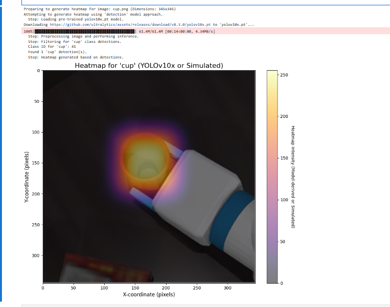

### Part 1: How the Attention Heatmap Works

The "heatmaps" we previously generated with YOLO are actually "**detection confidence maps**," showing where the model detected objects and their confidence levels. The "attention heatmaps" you're asking about are often referred to academically as **Class Activation Mapping (CAM)** or its improved version, **Grad-CAM**. They reveal a deeper question: **To make a specific classification decision, which regions of the image does the model focus its attention on?**

This is a powerful model interpretability (XAI) technology that allows us to "see through" the "thinking process" of neural networks.

#### 1. Core idea: Where is the model looking?

Imagine you look at a picture and decide, "That's a cat." Your brain automatically focuses on key features like the cat's ears, whiskers, eyes, and paws. An attention heatmap attempts to visualize where a neural network's gaze is focused when it does the same thing.

#### 2. Working Principle (Grad-CAM is used as an example, which is more general)

To understand how this works, we need to briefly review the structure of a convolutional neural network (CNN):

- **Convolutional Layers**: The first half of the network consists of multiple convolutional layers, which extract features from the image, from low-level edges and colors to higher-level contours and components (such as eyes and wheels). The later the convolutional layer, the more abstract and high-level the features extracted.
- **Feature Maps**: The output of each convolutional layer is a set of "feature maps." You can think of each feature map as a "detector" that specifically looks for a specific feature. For example, one feature map might activate for all "circular" areas in the image, while another might activate for all "pointy ears" areas.

- **Final Decision**: At the end of the network, the model combines the information from all these high-level feature maps to make a final classification decision (e.g., "There is a 98% probability that this image is a 'cup'").

**The "magic" of Grad-CAM is that it can calculate which feature maps contribute most to the final "cup" decision.**

Its steps can be simplified as follows:

1. **Select the target layer**: The last convolutional layer is typically chosen because it contains the richest high-level semantic information for decision-making.
2. **Calculate gradients**: The model performs a forward pass to obtain a predicted score for the "cup" class. It then calculates the gradient of this score with respect to each pixel in the selected target layer. This gradient intuitively represents the question, "If I slightly change the value of this pixel, how much will the predicted score for 'cup' change?" A larger gradient indicates that pixel is more important to the final decision.

3. **Calculate weights**: Average the gradients of each feature map to determine its importance for the "cup" decision.

4. **Generate heatmap**: Sum all feature maps according to their respective importance. Important feature maps (such as the "handle detector" and the "round rim detector") receive higher weights, while irrelevant feature maps receive lower weights. Finally, when these are superimposed, they highlight areas related to the cup in the original image. This is the attention heatmap.

**Summary**: The attention heat map (Grad-CAM) reveals the model's "attention focus" by analyzing gradients, finding the feature regions that contribute most to the final classification results, and visualizing them.

---

### Part 2: The Principle of YOLOv10

The core goal of YOLOv10 is to **achieve extreme end-to-end real-time performance while maintaining high accuracy**. Its main innovation lies in addressing a key bottleneck in the traditional YOLO model: **NMS (Non-Maximum Suppression)**.

#### 1. Pain Point: Why is NMS a problem?

In previous versions of YOLO, the model generated a large number of overlapping bounding boxes during inference. NMS is a post-processing step whose task is to:

- Check all highly overlapping detection boxes for the same object.
- Keep only the one with the highest confidence and delete the others.

While this process works, it has two major drawbacks:

- **Computational Overhead**: NMS itself requires computation, increasing inference latency.
- **Not End-to-End**: As a standalone post-processing module, the entire detection process is not an "end-to-end" system (from input to output), making it difficult to deploy and optimize.

#### 2. YOLOv10's core innovation: Farewell to NMS

YOLOv10 uses the **Consistent Dual Assignments** strategy to teach the model to suppress redundant detection boxes during training, thus eliminating the need for NMS during inference.

- **Dual Allocation**: During training, for each real object, traditional YOLO usually only allocates one or a few positive samples (prediction boxes). YOLOv10 uses two allocation strategies at the same time:
  - **One-to-One Matching**: Forces one branch to generate only one optimal, high-quality prediction box for each object. The goal of this branch is to achieve the highest detection accuracy.
  
  - **One-to-Many Matching**: Allows the other branch to generate multiple prediction boxes for each object like traditional YOLO, providing richer supervision signals and helping the model converge faster.
  
- **Consistency Supervision**: The model is trained to ensure that the best prediction box produced by the "one-to-one" branch is as consistent as possible with the prediction box with the highest score in the "one-to-many" branch.

In this way, the model learns how to autonomously select the "best representative" during training and only outputs the high-quality box during inference, so NMS is no longer needed for screening.

#### 3. Other key designs

In addition to NMS-free, YOLOv10 also carries out a series of "efficiency-accuracy driven designs from the overall perspective":

- **Lightweight Classification Head**: We found that classification is much less challenging than localization in detection tasks, so we significantly simplified the classification head structure and reduced computational effort.
- **Spatial-Channel Decoupled Downsampling**: Separately reducing feature map resolution (spatial) and transforming the number of features (channels) preserves information more effectively.

- **Large-Kernel Convolutions**: Using larger convolution kernels in the deep layers of the network effectively expands the receptive field and improves model performance, while incurring minimal overhead on modern computing devices.

**Summary**: YOLOv10 achieves end-to-end real-time object detection with lower latency than YOLOv8/v9 at the same accuracy through an innovative NMS-free training strategy and a series of sophisticated structural optimizations.

---

Okay, let's go ahead and finish this YOLO version of the comparison.

---

### Part 3: Comparison of different YOLO versions

The development history of the YOLO series is a history of the evolution of target detection in pursuit of faster, stronger and easier to use.

| Version                 | Approx. Year | Core Ideas / Main Contributions                         | Features Summary                                             |
| ----------------------- | ------------ | ------------------------------------------------------- | ------------------------------------------------------------ |
| **YOLOv1 - v3**         | 2015 - 2018  | **Groundbreaking Era: Pioneering Single-Stage Testing** | **v1**: Treated detection as a regression problem, resulting in extremely fast speed but average accuracy. **v2**: Introduced anchor boxes, significantly improving precision and recall. **v3**: Introduced multi-scale prediction and a more powerful Darknet-53 backbone network, becoming a classic. |
| **YOLOv4 / v5**         | 2020         | **The era of optimization and engineering**             | **v4**: This version introduced the "Bag of Freebies" and "Bag of Specials," systematically integrating nearly all of the most effective tricks at the time and representing a truly comprehensive offering. **v5**: Launched by the Ultralytics team, this version, based on PyTorch, places a strong emphasis on engineering practices, ease of use, and deployment. It offers a full range of models, from n to x, and has become the most widely used version. |
| **YOLOv6 / v7 / YOLOX** | 2021 - 2022  | **Anchor-Free**                                         | These models began exploring and transitioning to anchor-free designs, simplifying the training process. **YOLOX**: Introduced the SimOTA dynamic label allocation strategy. **YOLOv6**: Introduced the more efficient RepVGG architecture. **YOLOv7**: Proposed the Extended Efficient Layer Aggregation Network (E-ELAN), achieving an excellent balance between accuracy and speed. |
| **YOLOv8**              | 2023         | **NEW BENCHMARKS AND FULL UNIFICATION**                 | Building on the success of v5, Ultralytics has completely rebuilt it to become a new industry benchmark. It also utilizes an anchor-free design and introduces a new C2f module, further improving performance. Most importantly, it unifies multiple tasks, including detection, segmentation, and pose estimation, into a single framework, making it extremely flexible and powerful. |
| **YOLOv9**              | 2024         | **Information Bottleneck and Gradient Optimization**    | This paper proposes a novel concept to address the problem of information loss in deep networks. **Key Contributions**: The introduction of Programmable Gradient Information (PGI) and Generalized Efficient Layer Aggregation Networks (GELAN). PGI aims to address the problem of information dilution when propagating through deep networks, enabling the model to learn more complete features. |
| **YOLOv10**             | 2024         | **End-to-end Era without NMS**                          | This achieves true end-to-end real-time object detection, centered around removing the long-standing dependency on NMS post-processing. **Key Contribution**: By employing a "consistent double allocation" strategy during training, the model inherently suppresses redundant boxes, eliminating the need for NMS during inference and significantly reducing latency. |

```
%pip install ultralytics opencv-python
```

```python
import matplotlib.pyplot as plt
import numpy as np
from PIL import Image, ImageDraw # For image processing and drawing text on placeholders
import matplotlib.colors
import cv2 # OpenCV For Gaussian blur

# Try importing the YOLO model library
try:
    from ultralytics import YOLO
    YOLO_AVAILABLE = True
except ImportError:
    print("Warning: 'ultralytics' library not found. YOLO model functionality will be unavailable, falling back to simulated heatmap.")
    print("Please install the required libraries with 'pip install ultralytics opencv-python'.")
    YOLO_AVAILABLE = False

# --- Helper function: Generate a simulated heatmap (useful as a placeholder or fallback) ---
def generate_simulated_heatmap(image_width, image_height, object_center_x, object_center_y, object_width, object_height, max_intensity=255, falloff_rate=0.0005):
    """
    Generates a simulated heatmap for an object.
    Intensity is highest at the object's center and falls off.
    This function serves as a placeholder for actual model output or as a fallback.
    """
    y, x = np.ogrid[:image_height, :image_width]
    std_x = object_width / 2
    std_y = object_height / 2
    std_x = max(std_x, 1) # Avoid division by zero
    std_y = max(std_y, 1) # Avoid division by zero

    dist_sq = (((x - object_center_x)**2) / (2 * std_x**2)) + \
              (((y - object_center_y)**2) / (2 * std_y**2))
    heatmap = max_intensity * np.exp(-dist_sq * falloff_rate * 10)
    return np.clip(heatmap, 0, max_intensity)

# --- Function: Get heatmap from real model ---
def get_heatmap_from_actual_model(image_np, model_type='detection', object_class_name='cup'):
    """
    Attempts to get a heatmap from a real model.
    Uses YOLOv10x if available for object detection and heatmap generation.
    Otherwise, falls back to a simulated heatmap.

    Args:
        image_np (numpy.ndarray): Input image as a NumPy array (H, W, C).
        model_type (str): Currently only 'detection' is supported.
        object_class_name (str): Target class name for detection (e.g., 'cup').

    Returns:
        numpy.ndarray: Generated heatmap (2D array).
    """
    print(f"Attempting to generate heatmap using '{model_type}' model approach.")
    image_height, image_width = image_np.shape[:2]

    if model_type == 'detection' and YOLO_AVAILABLE:
        try:
            model_name = 'yolov10x.pt' # Try YOLOv10x, the larger model in the YOLOv10 family
            # model_name = 'yolov9c.pt' # You can change back to YOLOv9c or other models for testing
            # model_name = 'yolov8s.pt'
            print(f"  Step: Loading pre-trained {model_name} model.")
            model = YOLO(model_name)
            print("  Step: Preprocessing image and performing inference.")
            # You can adjust inference parameters such as the confidence threshold conf
            results = model(image_np, verbose=False, conf=0.25) # verbose=False, add conf parameter example

            heatmap = np.zeros((image_height, image_width), dtype=np.float32)
            detections_found = 0

            print(f"  Step: Filtering for '{object_class_name}' class detections.")
            target_cls_id = -1
            if hasattr(model, 'names') and isinstance(model.names, dict):
                for cls_id, name_val in model.names.items(): # Renamed 'name' to 'name_val' to avoid conflict
                    if name_val == object_class_name:
                        target_cls_id = cls_id
                        break
            else:
                print(f"  Warning: Model class names (model.names) not available in the expected format. Cannot map '{object_class_name}' to class ID.")


            if target_cls_id == -1:
                print(f"  Warning: Class '{object_class_name}' not found in model's classes or model.names not accessible. Will display an empty heatmap.")
            else:
                print(f"  Class ID for '{object_class_name}': {target_cls_id}")

                for result in results:
                    for box in result.boxes:
                        cls = int(box.cls)
                        conf = float(box.conf)
                        if cls == target_cls_id:
                            detections_found += 1
                            x1, y1, x2, y2 = map(int, box.xyxy[0])
                            # Fill the rectangle using confidence as heat value
                            cv2.rectangle(heatmap, (x1, y1), (x2, y2), conf, thickness=cv2.FILLED)

                if detections_found > 0:
                    print(f"  Found {detections_found} '{object_class_name}' detection(s).")
                    # Adjust the kernel size of Gaussian blur, which can be adjusted according to the effect
                    # Larger kernels produce more blurred (diffuse) heatmaps
                    blur_kernel_size = (101, 101) # You can try to reduce it to (51,51) or increase it
                    heatmap = cv2.GaussianBlur(heatmap, blur_kernel_size, 0)
                    if heatmap.max() > 0:
                        heatmap = (heatmap / heatmap.max()) * 255 # Normalized to 0-255
                    print("  Step: Heatmap generated based on detections.")
                    return heatmap.astype(np.uint8)
                else:
                    print(f"  No '{object_class_name}' detections found with current settings. Will display an empty heatmap.")
                    return heatmap # Return empty heatmap

        except Exception as e:
            print(f"  Error during YOLO model operation: {e}")
            print("  Fallback: Using simulated heatmap.")
            # Fallthrough to simulated heatmap generation

    # ----- Fallback to simulated heatmap if model is unavailable or an error occurs -----
    print("  Fallback: Using simulated heatmap as a placeholder.")
    center_x_ratio = 0.47
    center_y_ratio = 0.45
    width_ratio = 0.20
    height_ratio = 0.30

    obj_center_x_abs = int(center_x_ratio * image_width)
    obj_center_y_abs = int(center_y_ratio * image_height)
    obj_width_abs = int(width_ratio * image_width)
    obj_height_abs = int(height_ratio * image_height)

    simulated_heatmap = generate_simulated_heatmap(
        image_width, image_height,
        obj_center_x_abs, obj_center_y_abs,
        obj_width_abs, obj_height_abs
    )
    return simulated_heatmap

def plot_image_with_heatmap(image_path, heatmap_data, title="Object Detection Heatmap", alpha=0.6, cmap_name='inferno'):
    """
    Overlays a heatmap on an image and displays it. All plot text is in English.
    """
    try:
        img = Image.open(image_path).convert('RGB')
    except FileNotFoundError:
        print(f"Error: Image file not found at {image_path}.")
        img = Image.new('RGB', (500, 500), color = (128, 128, 128))
        draw = ImageDraw.Draw(img)
        draw.text((50, 230), "Image not found.\nPlease use a valid path.", fill=(255,0,0))
        heatmap_data = np.zeros((500, 500))
        print("Displaying placeholder image and empty heatmap.")

    img_np = np.array(img)

    fig, ax = plt.subplots(1, 1, figsize=(10, 8))
    ax.imshow(img_np)

    if heatmap_data.max() > 0:
        if heatmap_data.shape[0] != img_np.shape[0] or heatmap_data.shape[1] != img_np.shape[1]:
            print(f"Warning: Heatmap dimensions ({heatmap_data.shape}) differ from image dimensions ({img_np.shape[:2]}). Resizing heatmap.")
            heatmap_pil = Image.fromarray(heatmap_data.astype(np.uint8))
            heatmap_resized_pil = heatmap_pil.resize((img_np.shape[1], img_np.shape[0]), Image.BICUBIC)
            heatmap_data_resized = np.array(heatmap_resized_pil)
            cax = ax.imshow(heatmap_data_resized, cmap=plt.get_cmap(cmap_name), alpha=alpha, extent=(0, img_np.shape[1], img_np.shape[0], 0))
        else:
            cax = ax.imshow(heatmap_data, cmap=plt.get_cmap(cmap_name), alpha=alpha, extent=(0, img_np.shape[1], img_np.shape[0], 0))

        cbar = fig.colorbar(cax, ax=ax, orientation='vertical', fraction=0.046, pad=0.04)
        cbar.set_label('Heatmap Intensity (Model-derived or Simulated)', rotation=270, labelpad=15)
    else:
        print("Heatmap is empty (no detections or model not run), not overlaying.")

    ax.set_title(title, fontsize=16)
    ax.set_xlabel("X-coordinate (pixels)", fontsize=12)
    ax.set_ylabel("Y-coordinate (pixels)", fontsize=12)
    ax.axis('on')
    plt.tight_layout()
    plt.show()

if __name__ == '__main__':
    # --- Configuration ---
    image_file_path = 'cup.png' # By default, the top-view image that you mentioned was difficult to identify is used.
    # image_file_path = 'image_2d8ceb.png' # Previously recognized images
    # image_file_path = 'image_2d208d.jpg' # Another test image

    target_object_name = 'cup'

    # --- Loading an image ---
    try:
        img_for_model = Image.open(image_file_path).convert('RGB')
        img_np_for_model = np.array(img_for_model)
        img_height, img_width = img_np_for_model.shape[:2]
        print(f"Preparing to generate heatmap for image: {image_file_path} (Dimensions: {img_width}x{img_height})")
    except FileNotFoundError:
        print(f"Fatal Error: Image file '{image_file_path}' not found. Cannot proceed.")
        img_np_for_model = np.zeros((500, 500, 3), dtype=np.uint8)
        img_width, img_height = 500, 500


    # --- Generate Heatmap ---
    heatmap_output = get_heatmap_from_actual_model(
        img_np_for_model,
        model_type='detection',
        object_class_name=target_object_name
    )

    # --- Plot Image with Heatmap ---
    plot_title = f"Heatmap for '{target_object_name}' (YOLOv10x or Simulated)"
    plot_image_with_heatmap(
        image_path=image_file_path,
        heatmap_data=heatmap_output,
        title=plot_title,
        alpha=0.5,
        cmap_name='inferno'
    )

    if not YOLO_AVAILABLE:
        print("\nReminder: To use the actual YOLO model for heatmap generation, ensure 'ultralytics' and 'opencv-python' are installed.")
        print("You can install them via 'pip install ultralytics opencv-python'.")
        print("Currently displaying a simulated heatmap.")
```


