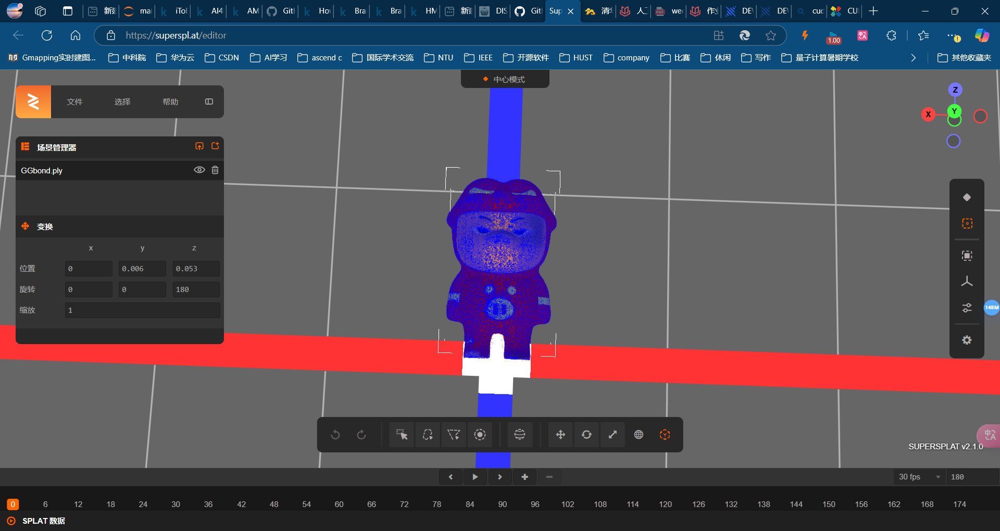
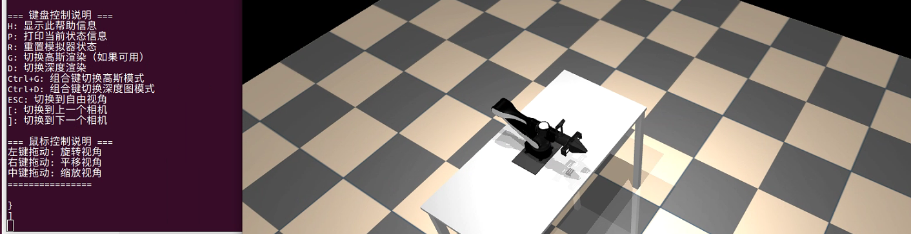
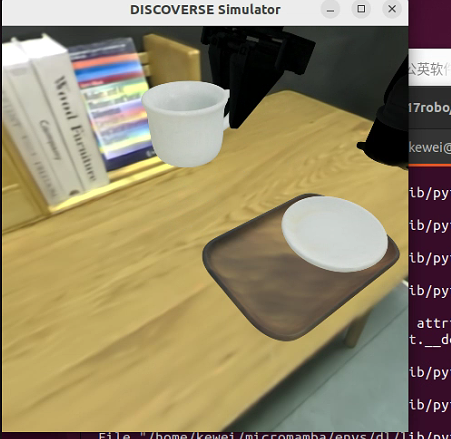
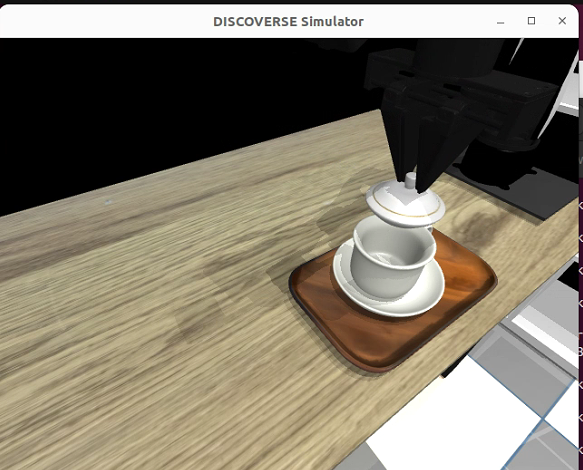
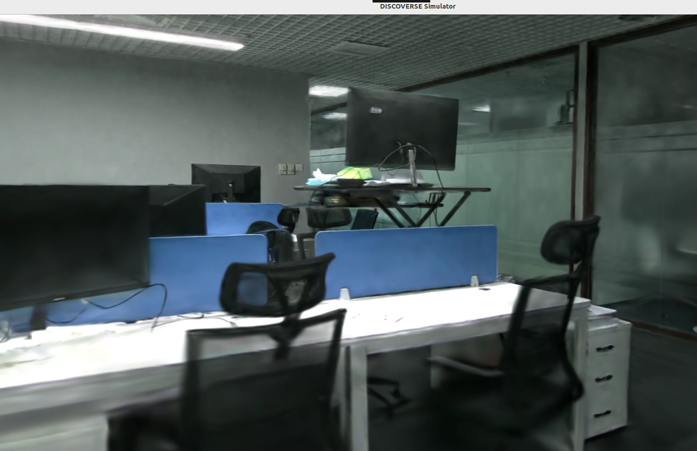

Paper Address

https://drive.google.com/file/d/1637XPqWMajfC_ZqKfCGxDxzRMrsJQA1g/view

Project Website [DISCOVERSE](https://air-discoverse.github.io/)

## 📦 Installation

[](https://github.com/TATP-233/DISCOVERSE/tree/main#-installation)

```shell
git clone https://github.com/TATP-233/DISCOVERSE.git --recursive
cd DISCOVERSE
pip install -r requirements.txt
pip install -e .
```

### Download Resource Files

[](https://github.com/TATP-233/DISCOVERSE/tree/main#download-resource-files)

Download the `meshes` and `textures` folders from [Baidu Netdisk](https://pan.baidu.com/s/1y4NdHDU7alCEmjC1ebtR8Q?pwd=bkca) or [Tsinghua Netdisk](https://cloud.tsinghua.edu.cn/d/0b92cdaeb58e414d85cc/) and place them under the `models` directory. After downloading the model files, the `models` directory will contain the following contents.

```
models
├── meshes
├── mjcf
├── textures
└── urdf
```

## 📷 Photorealistic Rendering

[](https://github.com/TATP-233/DISCOVERSE/tree/main#-photorealistic-rendering)

[](https://github.com/TATP-233/DISCOVERSE/blob/main/assets/img2.png)

### Preparation

[](https://github.com/TATP-233/DISCOVERSE/tree/main#preparation)

The physics engine of `DISCOVERSE` is [mujoco](https://github.com/google-deepmind/mujoco). If the user does not need the high-fidelity rendering function based on [3DGS](https://github.com/graphdeco-inria/gaussian-splatting), this section can be skipped. If photorealistic rendering is required, please follow the instructions in this subsection.

1. Install CUDA. Please install the corresponding version of CUDA according to your graphics card model from the [download link](https://developer.nvidia.com/cuda-toolkit-archive).

2. pip install -r requirements_gs.txt

3. Install `diff-gaussian-rasterization`
   
   ```shell
   cd submodules/diff-gaussian-rasterization/
   git checkout 8829d14
   ```
   
   Modify line 154 of `submodules/diff-gaussian-rasterization/cuda_rasterizer/auxiliary.h`, change `(p_view.z <= 0.2f)` to `(p_view.z <= 0.01f)`.
   
   ```shell
   cd ../..
   pip install submodules/diff-gaussian-rasterization
   ```

4. Prepare 3DGS model files. The high-fidelity visual effect of `DISCOVERSE` depends on 3DGS technology and corresponding model files. The pre-reconstructed robot, object, and scene models are placed on Baidu Netdisk [link](https://pan.baidu.com/s/1y4NdHDU7alCEmjC1ebtR8Q?pwd=bkca) and Tsinghua Netdisk [link](https://cloud.tsinghua.edu.cn/d/0b92cdaeb58e414d85cc/). After downloading the model files, the `models` directory will contain the following contents. (Note: Not all models are necessary. Users can download according to their own needs. It is recommended to download all ply models except those in the `scene` directory, and for the models in the `scene` folder, only download the ones that will be used.)

```
models
├── 3dgs
│   ├── airbot_play
│   ├── mmk2
│   ├── tok2
│   ├── skyrover
│   ├── hinge
│   ├── object
│   └── scene
├── meshes
├── mjcf
├── textures
└── urdf
```

Configure CUDA

On the website [CUDA Toolkit 12.8 Update 1 Downloads | NVIDIA Developer](https://developer.nvidia.com/cuda-downloads?target_os=Linux&target_arch=x86_64&Distribution=Ubuntu&target_version=22.04&target_type=deb_local)

```bash
wget https://developer.download.nvidia.com/compute/cuda/repos/ubuntu2204/x86_64/cuda-ubuntu2204.pin
sudo mv cuda-ubuntu2204.pin /etc/apt/preferences.d/cuda-repository-pin-600
wget https://developer.download.nvidia.com/compute/cuda/12.8.1/local_installers/cuda-repo-ubuntu2204-12-8-local_12.8.1-570.124.06-1_amd64.deb
sudo dpkg -i cuda-repo-ubuntu2204-12-8-local_12.8.1-570.124.06-1_amd64.deb
sudo cp /var/cuda-repo-ubuntu2204-12-8-local/cuda-*-keyring.gpg /usr/share/keyrings/
sudo apt-get update
sudo apt-get -y install cuda-toolkit-12-8
```

https://superspl.at/editor

[SuperSplat](https://superspl.at/editor)

View simulation modeling online



Check rendering effect



```bash
pip install mujoco==2.3.7
sudo apt-get install libosmesa6-dev freeglut3-dev
sudo apt install libglew-dev
```



The coffee cup placement is also very good.





Indoor 3D Gaussian reconstruction is very impressive.