To install Vulkan, run

```bash
sudo apt-get install libvulkan1
sudo apt-get install vulkan-utils
```
or
```bash
sudo apt install vulkan-tools
vulkaninfo
```

If it does not exist, try creating a file with the following content: `/usr/share/vulkan/icd.d/nvidia_icd.json`

{
 "file_format_version" : "1.0.0",
 "ICD": {
 "library_path": "libGLX_nvidia.so.0",
 "api_version" : "1.2.155"
 }
}

Test the installation

python -m mani_skill.examples.demo_random_action

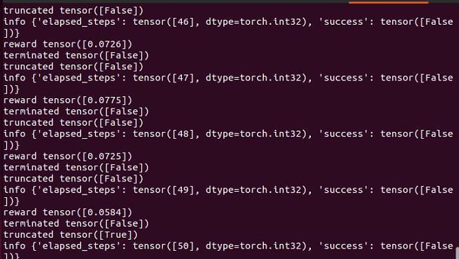

import gymnasium as gym
import mani_skill.envs

env = gym.make(
    "PickCube-v1", # there are more tasks e.g. "PushCube-v1", "PegInsertionSide-v1", ...
    num_envs=1,
    obs_mode="state", # there is also "state_dict", "rgbd", ...
    control_mode="pd_ee_delta_pose", # there is also "pd_joint_delta_pos", ...
    render_mode="human"
)
print("Observation space", env.observation_space)
print("Action space", env.action_space)

obs, _ = env.reset(seed=0) # reset with a seed for determinism
done = False
while not done:
    action = env.action_space.sample()
    obs, reward, terminated, truncated, info = env.step(action)
    done = terminated or truncated
    env.render()  # Rendering will not work without a display.
env.close()

# run headless / without a display

python -m mani_skill.examples.demo_random_action -e PickCube-v1

# run with A GUI and ray tracing

python -m mani_skill.examples.demo_random_action -e PickCube-v1 --render-mode="human" --shader="rt-fast"

python -m mani_skill.examples.benchmarking.gpu_sim --num-envs=1024

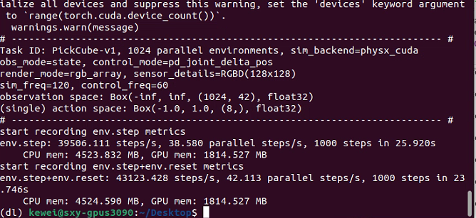

Parallel simulation runs really fast.

# rendering RGB + Depth data from all cameras

python -m mani_skill.examples.benchmarking.gpu_sim --num-envs=64 --obs-mode="rgbd"

# directly save 64 videos of the visual observations put into one video

python -m mani_skill.examples.benchmarking.gpu_sim --num-envs=64 --save-video

import gymnasium as gym
import mani_skill.envs

env = gym.make(
    "PickCube-v1",
    obs_mode="state",
    control_mode="pd_joint_delta_pos",
    num_envs=16,
    parallel_in_single_scene=True,
    viewer_camera_configs=dict(shader_pack="rt-fast"),
)
env.reset()
while True:
    env.step(env.action_space.sample())
    env.render_human()

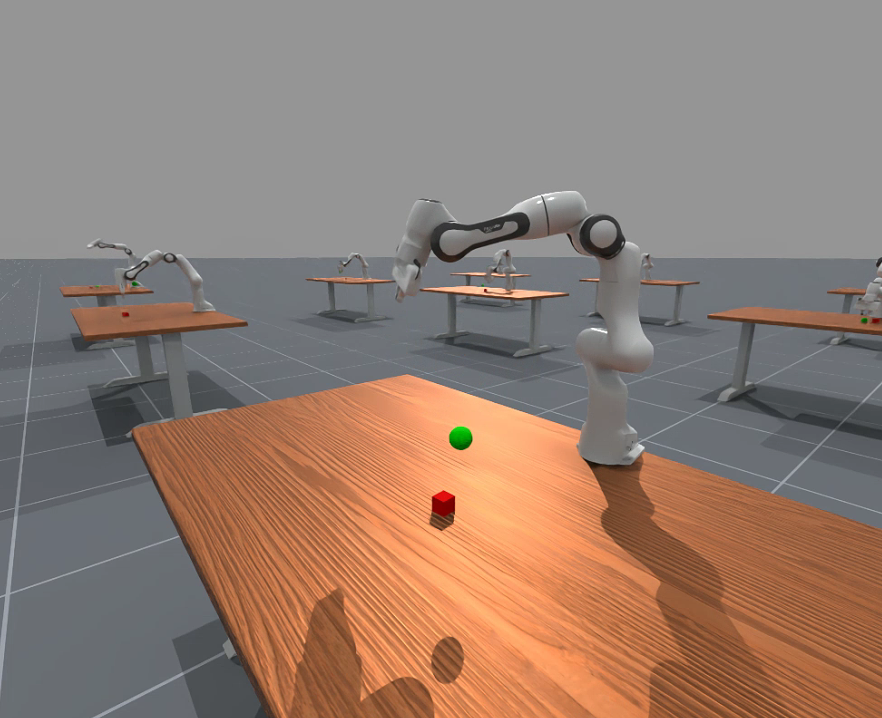

python -m mani_skill.examples.demo_random_action -e PushCube-v1 -b gpu --render-mode human --seed 42

This will generate a random simulation.

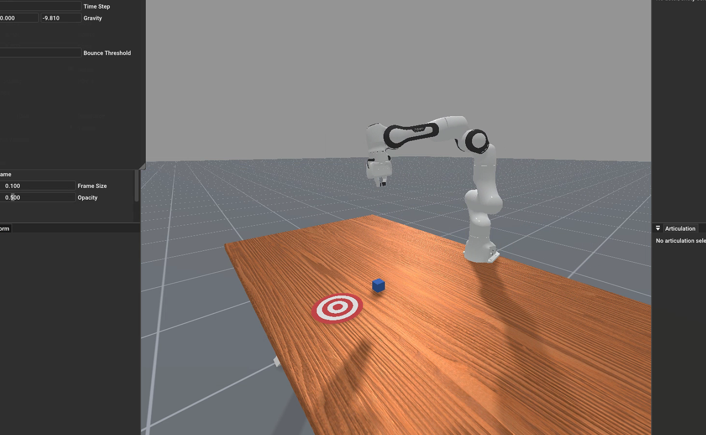

The default path for downloading data is

python -m mani_skill.utils.download_asset "ReplicaCAD"

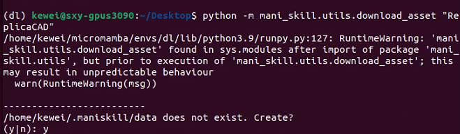

python -m mani_skill.examples.demo_random_action -e "ReplicaCAD_SceneManipulation-v1" \
  --render-mode="rgb_array" --record-dir="videos"

python -m mani_skill.examples.demo_random_action -e "ReplicaCAD_SceneManipulation-v1" \
  --render-mode="human" # run with GUI

python -m mani_skill.examples.demo_random_action -e "ReplicaCAD_SceneManipulation-v1" \
  --render-mode="human" --shader="rt-fast" # faster ray-tracing option but lower quality

python -m mani_skill.examples.demo_random_action -e "ReplicaCAD_SceneManipulation-v1" \
  --render-mode="human" --shader="rt" 

A moderately high resolution is recommended.

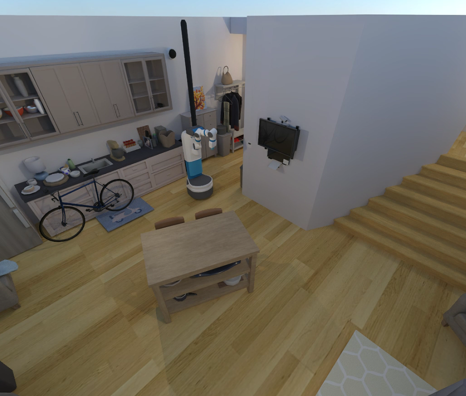

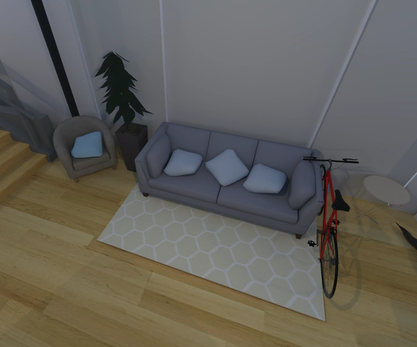

python -m mani_skill.examples.demo_random_action -e "TwoRobotStackCube-v1" \
  --render-mode="human"

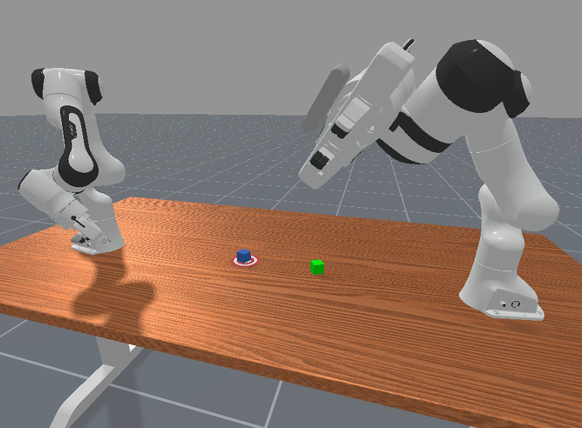

python -m mani_skill.examples.demo_random_action -e "RotateValveLevel2-v1" \
  --render-mode="human"

a dexterous hand.

python -m mani_skill.examples.demo_random_action -e "RotateSingleObjectInHandLevel3-v1" \
  --render-mode="human"

Simulated haptic feedback

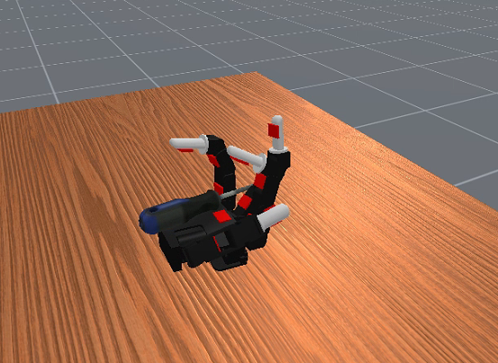

To benchmark GPU simulation on the PickCube-v1 task with 4096 parallel tasks, you can run

python -m mani_skill.examples.benchmarking.gpu_sim -e "PickCube-v1" -n 4096

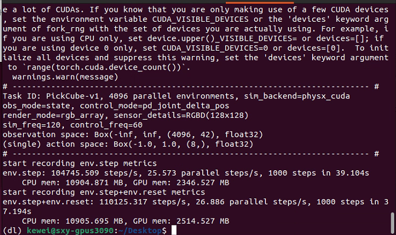

The speed is extremely fast

To save videos of the agent's observations (RGB and depth ), run

python -m mani_skill.examples.benchmarking.gpu_sim -e "PickCube-v1" -n 64 \
  --save-video --render-mode="sensors"

It should run quite fast—over 3000 fps on an RTX 4090. You can further increase the number of environments to gain even higher FPS. You can change `--render-mode="rgb_array"` to render from higher quality cameras.

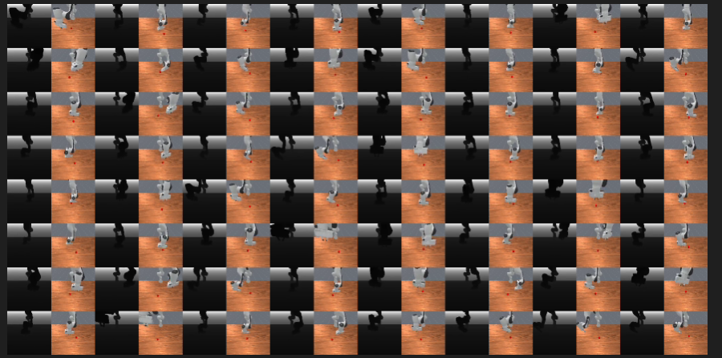

To try various parallel simulation features, you can run

python -m mani_skill.examples.benchmarking.gpu_sim -e "PickSingleYCB-v1" -n 64 \
  --save-video --render-mode="sensors"

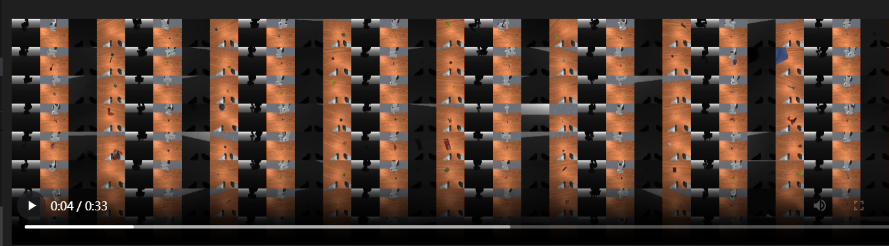

Training to grasp different objects simultaneously

python -m mani_skill.examples.benchmarking.gpu_sim -e "OpenCabinetDrawer-v1" -n 64 \
  --save-video --render-mode="sensors"

This example shows two tasks with different objects and joints in each parallel environment. Here's an example of the OpenCabinetDrawer task.

[See this page for more details and benchmark results.](https://maniskill.readthedocs.io/en/latest/user_guide/additional_resources/performance_benchmarking.html)

## Interactive Control[#](https://maniskill.readthedocs.io/en/latest/user_guide/demos/scripts.html#interactive-control "Permanent link to this heading")

Click + drag teleoperation:

A simple tool where you can click and drag the end effector of the Panda arm to solve various tasks. Just click and drag, press "n" to move to the position you dragged to, "g" to toggle grasp on/off, and repeat. Press "q" to exit and save the result video.

python -m mani_skill.examples.teleoperation.interactive_panda -e "StackCube-v1" 

For more details on how to use this tool (for demonstration and data collection), refer to the [homepage](https://maniskill.readthedocs.io/en/latest/user_guide/data_collection/teleoperation.html#click-drag-system). The video below shows the system in action.

Regarding this, there was a bug that I reported on discord

- python -m mani_skill.examples.teleoperation.interactive_panda -e "StackCube-v1" Traceback (most recent call last): File "/home/kewei/micromamba/envs/dl/lib/python3.9/runpy.py", line 197, in _run_module_as_main return _run_code(code, main_globals, None, File "/home/kewei/micromamba/envs/dl/lib/python3.9/runpy.py", line 87, in _run_code exec(code, run_globals) File "/home/kewei/micromamba/envs/dl/lib/python3.9/site-packages/mani_skill/examples/teleoperation/interactive_panda.py", line 11, in <module> from mani_skill.examples.motionplanning.panda_stick.motionplanner import \ ModuleNotFoundError: No module named 'mani_skill.examples.motionplanning.panda_stick' hi could anyone help me with this problem?

- _[17:36]_ 
  
  ok well I have solved it. Just install from github not pypi helped me out

- ### kewei_—_ Today 17:43
  
  it might be a issue in example code. the right should be
  
  `from mani_skill.examples.motionplanning.panda.motionplanner_stick import PandaStickMotionPlanningSolver`

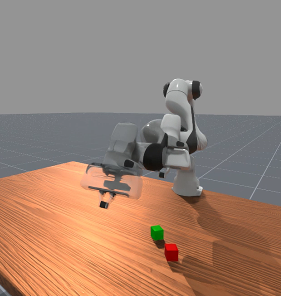

## Motion Planning Solutions[#](https://maniskill.readthedocs.io/en/latest/user_guide/demos/scripts.html#motion-planning-solutions "Permanent link to this heading")

We provide motion planning solutions/demos for the Panda arm on certain tasks, which you can now try and record demonstrations using the following:

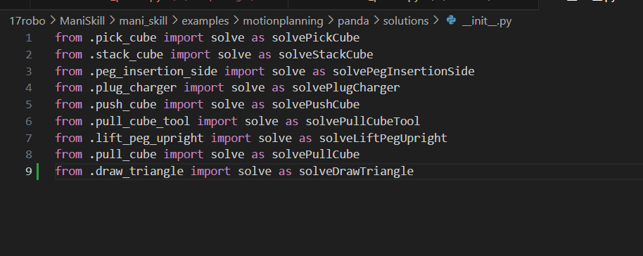

python -m mani_skill.examples.motionplanning.panda.run -e "PickCube-v1" # runs headless and only saves video
python -m mani_skill.examples.motionplanning.panda.run -e "StackCube-v1" --vis # opens up the GUI
python -m mani_skill.examples.motionplanning.panda.run -h # open up a help menu and also show what tasks have solutions

(dl) kewei@sxy-gpus3090:~/Desktop$ python -m mani_skill.examples.motionplanning.panda.run -h # open up a help menu and also show what tasks have solutions
usage: run.py [-h] [-e ENV_ID] [-o OBS_MODE] [-n NUM_TRAJ]
              [--only-count-success] [--reward-mode REWARD_MODE]
              [-b SIM_BACKEND] [--render-mode RENDER_MODE] [--vis]
              [--save-video] [--traj-name TRAJ_NAME] [--shader SHADER]
              [--record-dir RECORD_DIR] [--num-procs NUM_PROCS]

optional arguments:
  -h, --help            show this help message and exit
  -e ENV_ID, --env-id ENV_ID
                        Environment to run motion planning solver on.
                        Available options are ['DrawTriangle-v1',
                        'PickCube-v1', 'StackCube-v1', 'PegInsertionSide-v1',
                        'PlugCharger-v1', 'PushCube-v1', 'PullCubeTool-v1',
                        'LiftPegUpright-v1', 'PullCube-v1']
  -o OBS_MODE, --obs-mode OBS_MODE
                        Observation mode to use. Usually this is kept as
                        'none' as observations are not necesary to be stored,
                        they can be replayed later via the
                        mani_skill.trajectory.replay_trajectory script.
  -n NUM_TRAJ, --num-traj NUM_TRAJ
                        Number of trajectories to generate.
  --only-count-success  If true, generates trajectories until num_traj of them
                        are successful and only saves the successful
                        trajectories/videos
  --reward-mode REWARD_MODE
  -b SIM_BACKEND, --sim-backend SIM_BACKEND
                        Which simulation backend to use. Can be 'auto', 'cpu',
                        'gpu'
  --render-mode RENDER_MODE
                        can be 'sensors' or 'rgb_array' which only affect what
                        is saved to videos
  --vis                 whether or not to open a GUI to visualize the solution
                        live
  --save-video          whether or not to save videos locally
  --traj-name TRAJ_NAME
                        The name of the trajectory .h5 file that will be
                        created.
  --shader SHADER       Change shader used for rendering. Default is 'default'
                        which is very fast. Can also be 'rt' for ray tracing
                        and generating photo-realistic renders. Can also be
                        'rt-fast' for a faster but lower quality ray-traced
                        renderer
  --record-dir RECORD_DIR
                        where to save the recorded trajectories
  --num-procs NUM_PROCS
                        Number of processes to use to help parallelize the
                        trajectory replay process. This uses CPU
                        multiprocessing and only works with the CPU simulation
                        backend at the moment.

## Real2Sim Evaluation

ManiSkill3 supports extremely fast real2sim evaluation via GPU simulation + rendering of policies like RT-1 and Octo. For details on which environments are supported, see [this page](https://maniskill.readthedocs.io/en/latest/tasks/digital_twins/index.html ). To run inference of RT-1 and Octo, refer to the `maniskill3` branch of the SimplerEnv project (https://github.com/simpler-env/SimplerEnv/tree/maniskill3 ).

## Visualize Pointcloud Data

You can run the following to visualize the pointcloud observations (requires a display to work):

```bash
pip install "pyglet<2"  # make sure to install this dependency
python -m mani_skill.examples.demo_vis_pcd -e "StackCube-v1"
```

File: `/home/kewei/17robo/ManiSkill/mani_skill/examples/demo_vis_pcd.py`  
You must also modify this file.

On line 46 of `demo_vis_pcd.py`:

```python
pcd = trimesh.points.PointCloud(xyz, colors)
```

You need to **call `.cpu().numpy()`** on the `xyz` and `colors` variables to ensure they are NumPy arrays on the CPU, not GPU tensors.

**Modified code:**

```python
pcd = trimesh.points.PointCloud(xyz.cpu().numpy(), colors.cpu().numpy())
```

## Visualize Segmentation Data[#](https://maniskill.readthedocs.io/en/latest/user_guide/demos/scripts.html#visualize-segmentation-data)

You can run the following to visualize the segmentation data:

```bash
python -m mani_skill.examples.demo_vis_segmentation -e "StackCube-v1"
python -m mani_skill.examples.demo_vis_segmentation -e "StackCube-v1" \
  --id id_of_part  # mask out everything but the selected part
```

This command currently throws an error.

Visualizing 2 RGBD cameras
ID to Actor/Link name mappings
0: Background
1: Link, name - panda_link0
2: Link, name - panda_link1
3: Link, name - panda_link2
4: Link, name - panda_link3
5: Link, name - panda_link4
6: Link, name - panda_link5
7: Link, name - panda_link6
8: Link, name - panda_link7
9: Link, name - panda_link8
10: Link, name - panda_hand
11: Link, name - panda_hand_tcp
12: Link, name - panda_leftfinger
13: Link, name - panda_rightfinger
14: Link, name - camera_base_link
15: Link, name - camera_link
16: Actor, name - table-workspace
17: Actor, name - ground
18: Actor, name - cubeA
19: Actor, name - cubeB
Traceback (most recent call last):
  File "/home/kewei/micromamba/envs/dl/lib/python3.9/runpy.py", line 197, in _run_module_as_main
    return _run_code(code, main_globals, None,
  File "/home/kewei/micromamba/envs/dl/lib/python3.9/runpy.py", line 87, in _run_code
    exec(code, run_globals)
  File "/home/kewei/17robo/ManiSkill/mani_skill/examples/demo_vis_segmentation.py", line 144, in <module>
    main(parse_args())
  File "/home/kewei/17robo/ManiSkill/mani_skill/examples/demo_vis_segmentation.py", line 118, in main
    selected_id = reverse_seg_id_map[selected_id]
KeyError: 'id_of_part'

## Visualize Camera Textures (RGB, Depth, Albedo, etc.)

You can run the following commands to visualize any number of textures generated by the camera. Note that by default the shader used is the “default” shader, which outputs almost all textures you might need. See the [cameras and shaders page](https://maniskill.readthedocs.io/en/latest/user_guide/demos/scripts.html#../../ ).

```bash
python -m mani_skill.examples.demo_vis_textures -e "StackCube-v1" -o rgb+depth
python -m mani_skill.examples.demo_vis_textures -e "OpenCabinetDrawer-v1" -o rgb+depth+albedo+normal
```

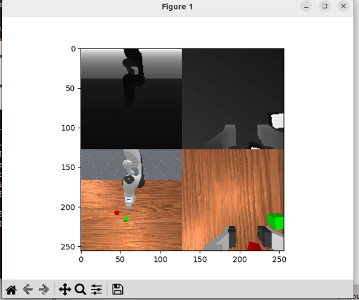

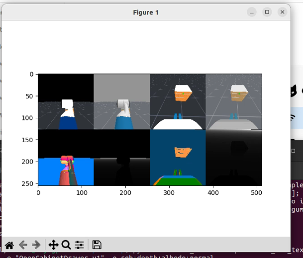

## Visualize Reset Distributions

Determining how difficult a task might be for ML algorithms like reinforcement learning and imitation learning can heavily depend on the reset distribution of the task. To see what the reset distribution of any task (the result of repeated `env.reset` calls) looks like, you can run the following command to save a video to the `videos` folder:

```bash
python -m mani_skill.examples.demo_reset_distribution -e "PegInsertionSide-v1" --record-dir="videos"
```

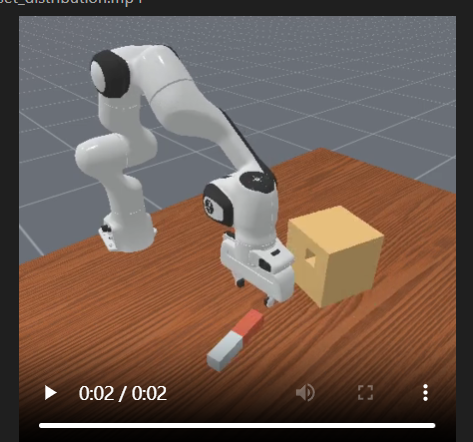

## Visualize Any Robot

Run the following command to open a viewer displaying any given robot in an empty scene with only a floor. You can also specify different keyframes if there are any predefined ones to visualize.

python -m mani_skill.examples.demo_robot -r "panda"

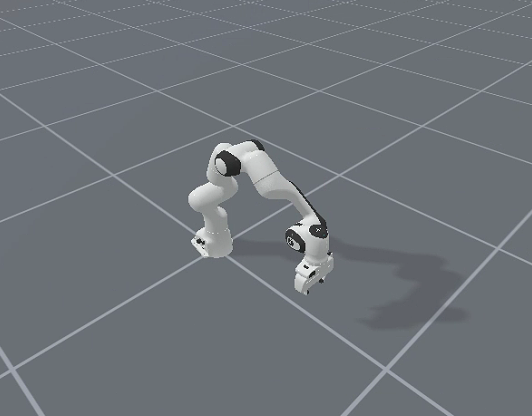
