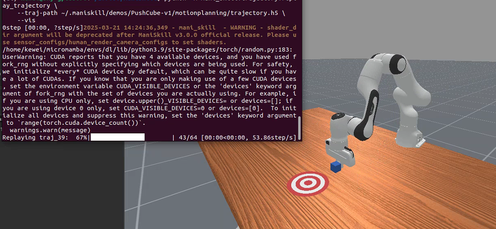
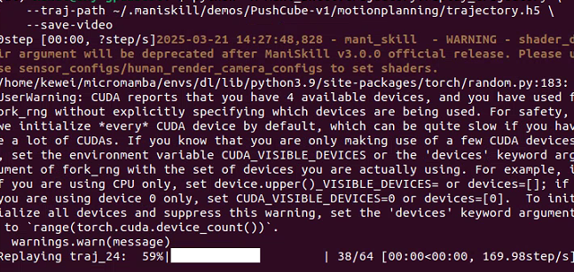
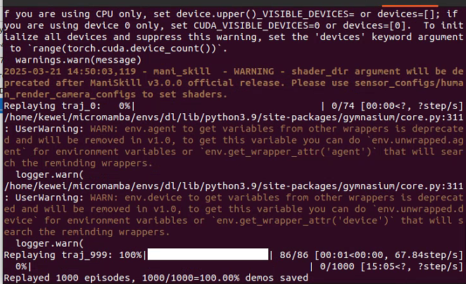
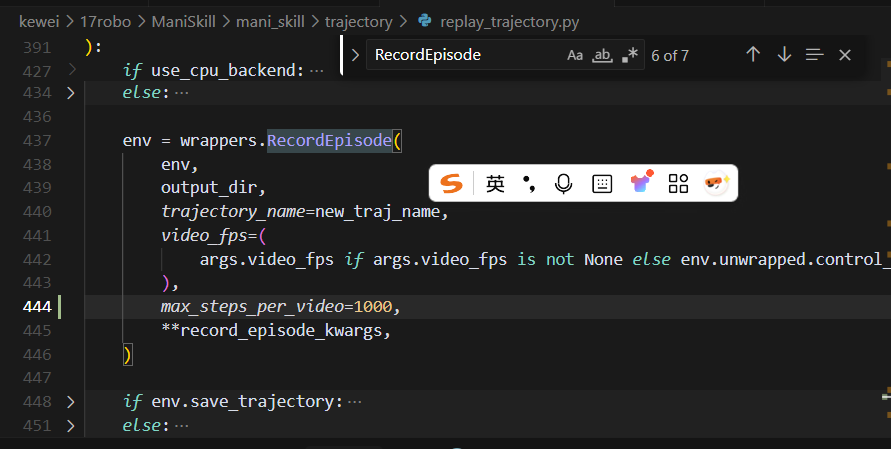
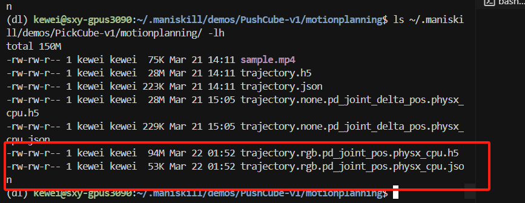
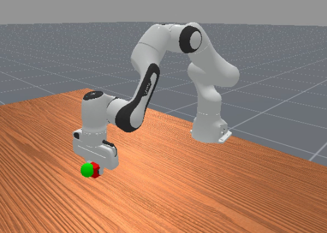

# Scene Datasets

We provide a command-line tool to download scene datasets (typically adapted from original datasets).

ManiSkill can build any scene as long as the relevant assets are provided. ManiSkill provides code and download links by default for using scene datasets such as [RoboCasa](https://github.com/robocasa/robocasa), [ReplicaCAD](https://aihabitat.org/datasets/replica_cad/), and [AI2THOR](https://github.com/allenai/ai2thor) (as shown below). These scenes were selected for their generally high modeling quality and interactivity.

ManiSkill also supports heterogeneous GPU simulation, where each parallel environment can have different objects and textures. The following is a bird's-eye view example generated by the simulator, showcasing a RoboCasa kitchen scene.

To get started with these scenes, you can download them using the following commands. Please note that if you use these scenes in your work, please cite both ManiSkill3 and the authors of the scene datasets.

```bash
# List all available downloadable scene datasets
python -m mani_skill.utils.download_asset --list "scene"
python -m mani_skill.utils.download_asset ReplicaCAD # Small scene, fast download
python -m mani_skill.utils.download_asset RoboCasa # Large procedurally generated scenes, fast download
python -m mani_skill.utils.download_asset AI2THOR # Large number of scenes, slow download
```

## Exploring Scene Datasets

To explore scene datasets, you can provide an environment ID and seed (if multiple scenes are available, you can change the sampled scene) and run a random action script. The following shows various pre-configured environments that you can use to interact with RoboCasa, ReplicaCAD, and ArchitecTHOR (a variant of AI2THOR).

```bash
python -m mani_skill.examples.demo_random_action \
  -e "ReplicaCAD_SceneManipulation-v1" \
  --render-mode="rgb_array" --record-dir="videos" # Run in headless mode and save video

python -m mani_skill.examples.demo_random_action \
  -e "ArchitecTHOR_SceneManipulation-v1" --render-mode="human" \
  -s 3 # Open GUI and sample a scene with seed 3

# Load 4 environments and sample scenes with seeds 0, 1, 2, 3
# Using fetch robot
python -m mani_skill.examples.demo_random_action \
  -e "RoboCasaKitchen-v1" \
  -n 4 -s 0 1 2 3 \
  --render-mode="human" -r "fetch"
```

You can also pass `-r "none"` to run the environment without any agents.

## Training on Scene Datasets

Large scene datasets like ReplicaCAD and AI2THOR, which contain hundreds of objects, can be used to train more generalizable robots/agents and can also serve as sources for synthetic data generation. We are still in the process of providing more example code and documentation to better utilize these scene datasets, but currently we provide code to explore and interact with these scene datasets.

### Reinforcement Learning / Imitation Learning

We are currently building task code similar to the ReplicaCAD Rearrange challenge and will open source it upon completion. Beyond that, there are currently no training tasks that have defined success/failure conditions and/or rewards, and use any large scene datasets.

# Demonstrations

We provide a command-line tool to download demonstrations directly from our [Hugging Face 🤗 dataset](https://huggingface.co/datasets/haosulab/ManiSkill_Demonstrations) by task ID. The tool downloads demonstration files to a folder and also downloads some videos showing what the demonstrations look like. For a list of all supported tasks and their demonstrations, see [Tasks](https://7mlcen.aitianhu6.top/tasks/index.md).

```bash
# Download demonstration dataset for a specific task
python -m mani_skill.utils.download_demo ${ENV_ID}
python -m mani_skill.utils.download_demo # Without parameters, this prints all available datasets
# Download the complete dataset (may be very slow)
python -m mani_skill.utils.download_demo all
```

Demonstration datasets are typically stored in a simplified format (e.g., without observation data), instead storing environment states for compression. We provide a flexible tool that can replay demonstration datasets and modify them, such as adding visual observations, recording videos, etc. For details, see the [Trajectory Replay Documentation](https://7mlcen.aitianhu6.top/datasets/replay.md). If you wish to generate the original compressed datasets locally, we have saved all the scripts we use for dataset generation in the [data_generation](https://github.com/haosulab/ManiSkill/tree/main/scripts/data_generation) folder. For users who wish to benchmark imitation learning, we strongly recommend following the instructions on the [Imitation Learning Setup Page](https://7mlcen.aitianhu6.top/learning_from_demos/setup.md) on how to replay compressed datasets for training dataset benchmarking.

## Format

All demonstrations for each task are saved in HDF5 format and can be opened with [h5py](https://github.com/h5py/h5py). Each HDF5 dataset is named `trajectory.{obs_mode}.{control_mode}.{sim_backend}.h5` and has a JSON metadata file with the same name. Unless otherwise specified, `trajectory.h5` is shorthand for `trajectory.none.pd_joint_pos.physx_cpu.h5`, which contains raw demonstrations generated by the `pd_joint_pos` controller, using `none` observation mode (empty observation data) and generated in CPU-based simulation. However, there may be demonstrations generated by other controllers. **Therefore, please check the associated JSON file to ensure which controller was used.**

## Metadata (JSON)

Each JSON file contains:

- `env_info` (dict): Task (also called environment) information that can be used to initialize the task
  - `env_id` (str): Task ID
  - `max_episode_steps` (int)
  - `env_kwargs` (dict): Keyword arguments for initializing the task. **This is required to reproduce the environment.**
- `episodes` (list[dict]): Episode information
- `source_type` (optional[str]): A simple classification string describing the process that generated the trajectory data.
- `source_desc` (optional[str]): A longer explanation of the data generation process.

Episode information (elements of `episodes`) includes:

- `episode_id` (int): Unique ID of the episode
- `reset_kwargs` (dict): Keyword arguments for resetting the task. **These parameters must be used when reproducing the trajectory.**
- `control_mode` (str): Control mode used for this episode.
- `elapsed_steps` (int): Trajectory length
- `info` (dict): Information at the end of the episode.

With just the metadata, you can usually reproduce the task exactly as it was created when the trajectory was collected:

```python
env = gym.make(env_info["env_id"], **env_info["env_kwargs"])
episode = env_info["episodes"][0] # Select the first one
env.reset(**episode["reset_kwargs"])
```

Sometimes trajectory data is collected in GPU simulation, which means randomization depends not only on seeds but also on the number of parallel environments. To ensure the same starting state, you can use the first environment state data stored in the trajectory and set the environment state accordingly.

## Trajectory Data (HDF5)

Each HDF5 demonstration dataset consists of multiple trajectories. The key for each trajectory is `traj_{episode_id}`, for example, `traj_0`.

Each trajectory is an `h5py.Group` that contains:

- actions: [T, A], `np.float32`. `T` is the number of transitions.
- terminated: [T], `np.bool_`. Indicates whether the task ended at each time step.
- truncated: [T], `np.bool_`. Indicates whether the task was truncated at each time step.
- env_states: [T+1, D], `np.float32`. Environment states. Can be used to set the environment to a specific state via `env.set_state_dict`. However, this may not be sufficient to reproduce the trajectory.
- success (optional): [T], `np.bool_`. Indicates whether the task was successful at each time step. This field is included if the task defines success.
- fail (optional): [T], `np.bool_`. Indicates whether the task failed at each time step. This field is included if the task defines failure.
- obs (optional): [T+1, D] Observation data.

Note that `env_states` is stored as a dictionary (and observation data may also be, depending on the observation mode), which is formatted as a dictionary of lists. For example, a typical environment state looks like this:

```python
env_state = env.get_state_dict()
"""
env_state = {
  "actors": {
    "actor_id": [...numpy_actor_state...],
    ...
  },
  "articulations": {
    "articulation_id": [...numpy_articulation_state...],
    ...
  }
}
"""
```

In the trajectory file, `env_states` will have the same structure, but each value/leaf node in the dictionary will be a sequence representing the state of that entity over time in the simulation.

In practice, it may be more useful to use slices of the `env_states` data (or observation data), which can be done as follows:

```python
import mani_skill.trajectory.utils as trajectory_utils
env_states = trajectory_utils.dict_to_list_of_dicts(env_states)
# Now env_states[i] is the data returned by env.get_state_dict() at time step i
i = 10
env_state_i = trajectory_utils.index_dict(env_states, i)
# Now env_state_i is the data returned by env.get_state_dict() at time step i
```

These tools are also used in our PyTorch dataset implementation, which is detailed in the next section.

## Loading Trajectory Datasets

### PyTorch

We provide an example way to build a PyTorch dataset and easily load trajectory .h5 data, see https://github.com/haosulab/ManiSkill/tree/main/mani_skill/trajectory/datasets.py. While it's not super optimized, it shows how to flexibly handle our data format. A copy of the code is pasted in the dropdown box below.

:::{dropdown} dataset.py
:color: primary
:icon: code

```python
from typing import Union
import h5py
import numpy as np
from torch.utils.data import Dataset
from tqdm import tqdm

from mani_skill.utils.io_utils import load_json
from mani_skill.utils import sapien_utils
from mani_skill.utils import common

# loads h5 data into memory for faster access
def load_h5_data(data):
    out = dict()
    for k in data.keys():
        if isinstance(data[k], h5py.Dataset):
            out[k] = data[k][:]
        else:
            out[k] = load_h5_data(data[k])
    return out

class ManiSkillTrajectoryDataset(Dataset):
    """
    A general PyTorch dataset that you can immediately use to load any trajectory .h5 data generated by ManiSkill.
    This class is just simple starter code to easily load trajectory data, but doesn't do any data transformation or advanced operations
    We recommend you directly copy this code and modify it for more advanced use cases

    Parameters:
        dataset_file (str): Path to the data .h5 file to load
        load_count (int): Number of trajectories to load into memory. If -1, will load all data
        success_only (bool): Whether to skip trajectories that are not ultimately successful. Default is False
        device: Location where data is saved. If None, will be stored in numpy format (default), otherwise will move data to the specified device
    """

    def __init__(self, dataset_file: str, load_count=-1, success_only: bool = False, device = None) -> None:
        self.dataset_file = dataset_file
        self.device = device
        self.data = h5py.File(dataset_file, "r")
        json_path = dataset_file.replace(".h5", ".json")
        self.json_data = load_json(json_path)
        self.episodes = self.json_data["episodes"]
        self.env_info = self.json_data["env_info"]
        self.env_id = self.env_info["env_id"]
        self.env_kwargs = self.env_info["env_kwargs"]

        self.obs = None
        self.actions = []
        self.terminated = []
        self.truncated = []
        self.success, self.fail, self.rewards = None, None, None
        if load_count == -1:
            load_count = len(self.episodes)
        for eps_id in tqdm(range(load_count)):
            eps = self.episodes[eps_id]
            if success_only: 
                assert "success" in eps, "episodes in this dataset do not have the success attribute, cannot load dataset with success_only=True"
                if not eps["success"]:
                    continue
            trajectory = self.data[f"traj_{eps['episode_id']}"]
            trajectory = load_h5_data(trajectory)
            eps_len = len(trajectory["actions"])

            # exclude the final observation as most learning workflows do not use it
            obs = common.index_dict_array(trajectory["obs"], slice(eps_len))
            if eps_id == 0:
                self.obs = obs
            else:
                self.obs = common.append_dict_array(self.obs, obs)

            self.actions.append(trajectory["actions"])
            self.terminated.append(trajectory["terminated"])
            self.truncated.append(trajectory["truncated"])

            # handle data that might optionally be in the trajectory
            if "rewards" in trajectory:
                if self.rewards is None:
                    self.rewards = [trajectory["rewards"]]
                else:
                    self.rewards.append(trajectory["rewards"])
            if "success" in trajectory:
                if self.success is None:
                    self.success = [trajectory["success"]]
                else:
                    self.success.append(trajectory["success"])
            if "fail" in trajectory:
                if self.fail is None:
                    self.fail = [trajectory["fail"]]
                else:
                    self.fail.append(trajectory["fail"])

        self.actions = np.vstack(self.actions)
        self.terminated = np.concatenate(self.terminated)
        self.truncated = np.concatenate(self.truncated)

        if self.rewards is not None:
            self.rewards = np.concatenate(self.rewards)
        if self.success is not None:
            self.success = np.concatenate(self.success)
        if self.fail is not None:
            self.fail = np.concatenate(self.fail)

        def remove_np_uint16(x: Union[np.ndarray, dict]):
            if isinstance(x, dict):
                for k in x.keys():
                    x[k] = remove_np_uint16(x[k])
                return x
            else:
                if x.dtype == np.uint16:
                    return x.astype(np.int32)
                return x

        # uint16 dtype is used to conserve disk space and memory
        # you can optimize this dataset code to keep it as uint16 and process that
        # dtype of data yourself. for simplicity we simply cast to a int32 so
        # it can automatically be converted to torch tensors without complaint
        self.obs = remove_np_uint16(self.obs)

        if device is not None:
            self.actions = sapien_utils.to_tensor(self.actions, device=device)
            self.obs = sapien_utils.to_tensor(self.obs, device=device)
            self.terminated = sapien_utils.to_tensor(self.terminated, device=device)
            self.truncated = sapien_utils.to_tensor(self.truncated, device=device)
            if self.rewards is not None:
                self.rewards = sapien_utils.to_tensor(self.rewards, device=device)
            if self.success is not None:
                self.success = sapien_utils.to_tensor(self.terminated, device=device)
            if self.fail is not None:
                self.fail = sapien_utils.to_tensor(self.truncated, device=device)
    def __len__(self):
        return len(self.actions)


    def __getitem__(self, idx):
        action = sapien_utils.to_tensor(self.actions[idx], device=self.device)
        obs = common.index_dict_array(self.obs, idx, inplace=False)

        res = dict(
            obs=obs,
            action=action,
            terminated=self.terminated[idx],
            truncated=self.truncated[idx],
        )
        if self.rewards is not None:
            res.update(reward=self.rewards[idx])
        if self.success is not None:
            res.update(success=self.success[idx])
        if self.fail is not None:
            res.update(fail=self.fail[idx])
        return res
```

:::

# Trajectory Replay/Conversion

ManiSkill provides tools not only to collect/load trajectories but also to replay trajectories and convert observations/actions.

To replay a demonstration (without changing observation mode and control mode):

```bash
# Replay and view the trajectory through sapien viewer
python -m mani_skill.trajectory.replay_trajectory \
    --traj-path ~/.maniskill/demos/PushCube-v1/motionplanning/trajectory.h5 \
    --vis

# Save a video of the trajectory (saved to the same directory as the trajectory)
python -m mani_skill.trajectory.replay_trajectory \
    --traj-path ~/.maniskill/demos/PushCube-v1/motionplanning/trajectory.h5 \
    --save-video

# View all available options
python -m mani_skill.trajectory.replay_trajectory -h
```

The results are as follows respectively





:::{note}
This script requires both `trajectory.h5` and `trajectory.json` files to be located in the same directory.
:::

By default, the original demonstration files contain all the necessary information needed to reproduce the trajectory (e.g., initial states, actions, seeds). Since there is no post-processing, observation data is usually not included as they can cause the file size to be too large. Additionally, the actions in these files do not cover all control modes. Therefore, you need to convert the original files to the observation and control modes you need. We provide a utility script that can be used as follows:

```bash
# Replay demonstration with control mode as pd_joint_delta_pos
python -m mani_skill.trajectory.replay_trajectory \
  --traj-path ~/.maniskill/demos/PickCube-v1/motionplanning/trajectory.h5 \
  --save-traj --target-control-mode pd_joint_delta_pos \
  --obs-mode none #--num-procs 10
```



:::{dropdown} Click to view trajectory replay tool options

```
╭─ options ──────────────────────────────────────────────────────────────────────────────────────────────────────────────────────────────────────╮
│ -h, --help              Show this help message and exit                                                                                      │
│ --traj-path STR         Path to the trajectory .h5 file to replay (required)                                                                │
│ --sim-backend {None}|STR, -b {None}|STR                                                                                                      │
│                         Simulation backend to use, can be 'physx_cpu' or 'physx_gpu'. If not specified, defaults to the backend used when   │
│                         collecting trajectory data. (default: None)                                                                          │
│ --obs-mode {None}|STR, -o {None}|STR                                                                                                         │
│                         Target observation mode to record in the trajectory. See                                                            │
│                         https://maniskill.readthedocs.io/en/latest/user_guide/concepts/observation.html for a complete list of supported     │
│                         observation modes. (default: None)                                                                                   │
│ --target-control-mode {None}|STR, -c {None}|STR                                                                                            │
│                         Target control mode to convert to.                                                                                  │
│                         Note that not all control modes can be successfully converted, and not all robots have easily convertible control   │
│                         modes. Currently Panda robots have the best support for control mode conversion. Additionally, control mode        │
│                         conversion is not supported in GPU parallelized environments. (default: None)                                      │
│ --verbose, --no-verbose                                                                                                                      │
│                         Whether to print detailed information during trajectory replay. (default: False)                                    │
│ --save-traj, --no-save-traj                                                                                                                  │
│                         Whether to save the trajectory to disk. This will not overwrite the original trajectory file. (default: False)      │
│ --save-video, --no-save-video                                                                                                                │
│                         Whether to save video. (default: False)                                                                             │
│ --num-procs INT         Number of processes used to parallelize the trajectory replay process. For CPU backends, this is usually parallelized │
│                         via Python multiprocessing. For parallel simulation backends like physx_gpu, this will be parallelized within a single │
│                         Python process by utilizing the GPU. (default: 1)                                                                   │
│ --max-retry INT         Maximum number of replay attempts before the task ends successfully. (default: 0)                                  │
│ --discard-timeout, --no-discard-timeout                                                                                                    │
│                         Whether to discard episodes that time out and are truncated (depends on the task's max_episode_steps parameter).    │
│                         (default: False)                                                                                                   │
│ --allow-failure, --no-allow-failure                                                                                                        │
│                         Whether to include failed episodes in saved videos and trajectory data, determined by the "success" label returned  │
│                         by the environment's evaluation. (default: False)                                                                    │
│ --vis, --no-vis         Whether to visualize trajectory replay through GUI. (default: False)                                               │
│ --use-env-states, --no-use-env-states                                                                                                      │
│                         Whether to replay via environment states rather than actions. This can guarantee that the environment looks exactly │
│                         the same as the original trajectory at every step. (default: False)                                                  │
│ --use-first-env-state, --no-use-first-env-state                                                                                            │
│                         Whether to use the first environment state in the trajectory to set the initial state. This is useful for trying to  │
│                         replay demonstrations collected in CPU simulation in GPU simulation, as GPU simulation randomizes initial states       │
│                         differently even with the same seed. (default: False)                                                            │
│ --count {None}|INT      Number of demonstrations to replay before exiting. By default will replay all demonstrations. (default: None)       │
│ --reward-mode {None}|STR                                                                                                                     │
│                         Specify the reward type the environment should use. By default will select the first supported reward mode. Most      │
│                         environments support 'sparse', 'none', and some also support 'normalized_dense' and 'dense' reward modes.             │
│                         (default: None)                                                                                                    │
│ --record-rewards, --no-record-rewards                                                                                                      │
│                         Whether to include rewards in the replayed trajectory. (default: False)                                           │
│ --shader {None}|STR     Change the shader used for all camera rendering. By default uses the shader used during original data collection.   │
│                         Can choose 'rt' for ray-traced photorealistic rendering, or 'rt-fast' for faster but lower quality ray-traced        │
│                         rendering. (default: None)                                                                                          │
│ --video-fps {None}|INT  FPS for saving video. Defaults to control frequency. (default: None)                                             │
│ --render-mode STR       Render mode used for saving video. Usually also includes 'sensors' and 'all' render modes, which further render all │
│                         sensor outputs such as cameras. (default: rgb_array)                                                                │
│ --num-envs INT, -n INT  Number of environments to run to replay trajectory. For CPU backends, this is usually parallelized via Python        │
│                         multiprocessing. For parallel simulation backends like physx_gpu, this will be parallelized within a single Python    │
│                         process by utilizing the GPU. (default: 1)                                                                         │
╰────────────────────────────────────────────────────────────────────────────────────────────────────────────────────────────────────────────────╯
```

However, the latest parameters have changed

╭─ options ──────────────────────────────────────────────────────────────────╮
│ -h, --help                                                                 │
│     Show help message and exit                                             │
│ --traj-path STR                                                            │
│     Path to the trajectory .h5 file to replay (required)                   │
│ -b {None}|STR, --sim-backend {None}|STR                                   │
│     Simulation backend to use. Can be 'physx_cpu' or 'physx_gpu'. If not   │
│     specified, defaults to the backend used when collecting trajectory     │
│     data. (default: None)                                                  │
│ -o {None}|STR, --obs-mode {None}|STR                                      │
│     Target observation mode to record observation data in the trajectory.  │
│     See https://maniskill.readthedocs.io/en/latest/user_guide/concepts/observ… │
│     for a complete list of all supported observation modes. (default: None) │
│ -c {None}|STR, --target-control-mode {None}|STR                            │
│     Target control mode to convert demonstration actions to other control  │
│     modes. Note that not all control modes can be successfully converted,  │
│     and not all robots support easy conversion of control modes.           │
│     Currently, Panda robots have the best support for control mode          │
│     conversion. And control mode conversion is not supported in GPU          │
│     parallelized environments. (default: None)                             │
│ --verbose, --no-verbose                                                    │
│     Whether to print detailed information when replaying trajectory.        │
│     (default: False)                                                      │
│ --save-traj, --no-save-traj                                                │
│     Whether to save the trajectory to disk. This operation will not        │
│     overwrite the original trajectory file. (default: False)               │
│ --save-video, --no-save-video                                              │
│     Whether to save video. (default: False)                               │
│ --max-retry INT                                                            │
│     Maximum number of replay attempts when replaying trajectory until task │
│     ends in successful state. (default: 0)                                │
│ --discard-timeout, --no-discard-timeout                                    │
│     Whether to discard episodes that time out and are truncated           │
│     (depends on the task's max_episode_steps parameter).                   │
│     (default: False)                                                      │
│ --allow-failure, --no-allow-failure                                        │
│     Whether to include failed episodes in saved videos and trajectory      │
│     data, based on the "success" label returned by the environment's       │
│     evaluation. (default: False)                                           │
│ --vis, --no-vis                                                            │
│     Whether to visualize replayed trajectory through GUI.                   │
│     (default: False)                                                      │
│ --use-env-states, --no-use-env-states                                      │
│     Whether to replay using environment states instead of actions. This     │
│     ensures that the environment state at each step is identical to the    │
│     original trajectory. (default: False)                                 │
│ --use-first-env-state, --no-use-first-env-state                            │
│     Use the first environment state in the trajectory to set the initial   │
│     state. This is useful for replaying demonstrations collected in CPU      │
│     simulation in GPU simulation, as GPU simulation randomizes initial      │
│     states differently than CPU simulation even with the same seed.        │
│     (default: False)                                                      │
│ --count {None}|INT                                                         │
│     Number of demonstrations to replay before exiting. By default, will    │
│     replay all demonstrations. (default: None)                            │
│ --reward-mode {None}|STR                                                   │
│     Specify the reward type the environment should use. By default will     │
│     select the first supported reward mode. Most environments support       │
│     'sparse', 'none', and some environments also support                   │
│     'normalized_dense' and 'dense' reward modes. (default: None)          │
│ --record-rewards, --no-record-rewards                                      │
│     Whether to include rewards in the replayed trajectory.                 │
│     (default: False)                                                      │
│ --shader {None}|STR                                                        │
│     Change the shader used for all camera rendering. The default value is   │
│     none, which uses the shader used during original data collection or    │
│     the environment default shader. Can also be set to 'rt' to enable      │
│     ray tracing for photorealistic rendering. Can also be set to           │
│     'rt-fast' to enable faster but lower quality ray tracing rendering.     │
│     (default: None)                                                        │
│ --video-fps {None}|INT                                                     │
│     Frame rate for saving video. Defaults to control frequency.            │
│     (default: None)                                                        │
│ --render-mode STR                                                          │
│     Render mode used when saving video. Usually also includes 'sensors'    │
│     and 'all' render modes, which can render all sensor outputs such as     │
│     cameras. (default: rgb_array)                                          │
│ -n INT, --num-envs INT                                                     │
│     Number of environments used to replay trajectory. For CPU backends,    │
│     this is usually parallelized via Python multiprocessing. For parallel   │
│     simulation backends like physx_gpu, this is usually parallelized       │
│     within a single Python process by utilizing the GPU. (default: 1)      │
╰────────────────────────────────────────────────────────────────────────────╯

The following table lists the comparison of each parameter in the old and new versions:

| Parameter                                                    | Old Version Description                                                                 | New Version Description                            | Notes           |
| ----------------------------------------------------------- | ------------------------------------------------------------------------------------ | ------------------------------------------------ | --------------- |
| **--traj-path STR**                                          | Path to the trajectory .h5 file to replay (required)                                  | Path to the trajectory .h5 file to replay (required) | No change       |
| **--sim-backend {None}│STR, -b {None}│STR**                   | Simulation backend to use, can be 'physx_cpu' or 'physx_gpu'. If not specified, defaults to the backend used when collecting trajectory data. (default: None) | Same as old version | No change       |
| **--obs-mode {None}│STR, -o {None}│STR**                      | Target observation mode to record observation data in the trajectory. See documentation for list of supported observation modes. (default: None) | Same as old version | No change       |
| **--target-control-mode {None}│STR, -c {None}│STR**       | Target control mode to convert demonstration actions to other control modes. Note not all control modes can be successfully converted, currently Panda robots have best support; GPU environments don't support conversion. (default: None) | Same as old version | No change       |
| **--verbose, --no-verbose**                                  | Whether to print detailed information during trajectory replay. (default: False)     | Whether to print detailed information when replaying trajectory. (default: False) | Slightly different description but same function |
| **--save-traj, --no-save-traj**                              | Whether to save trajectory to disk, will not overwrite original trajectory file. (default: False) | Whether to save trajectory to disk, will not overwrite original trajectory file. (default: False) | No change       |
| **--save-video, --no-save-video**                            | Whether to save video. (default: False)                                               | Whether to save video. (default: False)           | No change       |
| **--num-procs INT**                                          | Number of processes used to parallelize trajectory replay process. CPU backends use Python multiprocessing; physx_gpu backends use GPU parallelization within single process. (default: 1) | **Removed**                          | Removed in new version |
| **--max-retry INT**                                          | Maximum number of replay attempts when replaying trajectory until task ends in successful state. (default: 0) | Same as old version | No change       |
| **--discard-timeout, --no-discard-timeout**                  | Whether to discard episodes that time out and are truncated (depends on task's max_episode_steps parameter). (default: False) | Same as old version | No change       |
| **--allow-failure, --no-allow-failure**                      | Whether to include failed episodes in saved videos and trajectory data, based on "success" label returned by environment evaluation. (default: False) | Same as old version | No change       |
| **--vis, --no-vis**                                          | Whether to visualize trajectory replay through GUI. (default: False)                  | Same as old version | No change       |
| **--use-env-states, --no-use-env-states**                    | Whether to replay using environment states instead of actions, ensuring environment is identical to original trajectory at each step. (default: False) | Same as old version | No change       |
| **--use-first-env-state, --no-use-first-env-state**          | Whether to use the first environment state in the trajectory as initial state, useful for replaying CPU-collected demonstrations in GPU simulation. (default: False) | Same as old version | No change       |
| **--count {None}│INT**                                       | Number of demonstrations to replay before exiting, defaults to replay all demonstrations. (default: None) | Same as old version | No change       |
| **--reward-mode {None}│STR**                                 | Specify reward type the environment should use, most environments support 'sparse', 'none', some support 'normalized_dense' and 'dense'. (default: None) | Same as old version | No change       |
| **--record-rewards, --no-record-rewards**                    | Whether to include rewards in replayed trajectory. (default: False)                   | Same as old version | No change       |
| **--shader {None}│STR**                                      | Change shader used for all camera rendering. Default uses shader from original data collection or environment default; optional 'rt' (ray tracing) or 'rt-fast' (fast ray tracing). (default: None) | Same as old version | No change       |
| **--video-fps {None}│INT**                                   | Frame rate for saving video, defaults to control frequency. (default: None)          | Same as old version | No change       |
| **--render-mode STR**                                        | Render mode used when saving video, supports 'rgb_array', 'sensors', 'all' modes, latter two can render all sensor data. (default: rgb_array) | Same as old version | No change       |
| **--num-envs INT, -n INT**                                   | Number of environments used to replay trajectory. CPU backends use Python multiprocessing; physx_gpu backends use GPU parallelization within single process. (default: 1) | Same as old version | No change       |

As shown in the table, the latest version mainly removes the **--num-procs** parameter, while the other parameters and their functions remain basically the same.

:::

:::{caution}
Because some demonstrations are collected in a non-quasi-static manner (objects are not fixed on the manipulator during operation) or some challenging tasks (e.g., PushT-v1 or PickSingleYCB-v1) require high precision, replaying actions/converting actions may fail due to non-determinism in the simulation. Therefore, it is necessary to replay trajectories by passing `--use-env-states` to ensure that the replayed states/observation data are identical to the original trajectory.
:::

## Example Usage

As the trajectory replay tool is feature-rich and complex, we recommend several example workflows for various use cases.

### Replay trajectory from one control mode to a more learnable control mode

In machine learning workflows, it is sometimes easier to learn from some control modes (e.g., end-effector control modes). The following example does exactly this:

```bash
python -m mani_skill.trajectory.replay_trajectory \
  --traj-path path/to/trajectory.h5 \
  -c pd_ee_delta_pose -o state \
  --save-traj
```

Note that due to inherent differences between controllers and demonstration behaviors, some target control modes may be difficult to convert.

1. **PickCube-v1 task**: This is a relatively simple task suitable for initial testing
   
   - `~/.maniskill/demos/PickCube-v1/rl/trajectory.none.pd_joint_delta_pos.physx_cuda.h5` (source control mode: joint control)
   - Conversion target: `pd_ee_delta_pose` (end-effector pose control)

2. **PushCube-v1 task**: This is a box-pushing task with relatively simple actions
   
   - `~/.maniskill/demos/PushCube-v1/rl/trajectory.none.pd_joint_delta_pos.physx_cuda.h5` (source control mode: joint control)
   - Conversion target: `pd_ee_delta_pose` (end-effector position control)

3. **StackCube-v1 task**: This is a more complex stacking task that requires more precise control
   
   - `~/.maniskill/demos/StackCube-v1/rl/trajectory.none.pd_ee_delta_pos.physx_cuda.h5` (source control mode: end-effector position control)
   - Conversion target: `pd_ee_delta_pose` (end-effector pose control)

To view the test results, you can:

1. **View generated trajectory files**: After replay, a new h5 file will be generated with the target control mode in the filename
2. **View generated videos**: Use `--render-mode rgb_array --render-camera third_view --replay-render` parameters to generate replay videos
3. **Compare before and after trajectories**: You can compare the MP4 videos of the original trajectory and replayed trajectory to see if the robot's behavior is similar

I recommend starting with the **PickCube-v1** task for testing, as it is the most basic picking task. You can execute the following command:

```bash
python -m mani_skill.trajectory.replay_trajectory \
  --traj-path ~/.maniskill/demos/PickCube-v1/rl/trajectory.none.pd_joint_delta_pos.physx_cuda.h5 \
  -c pd_ee_delta_pose -o state \
  --render-mode rgb_array --render-camera third_view --replay-render \
  --save-traj
```

This command will:

1. Read the source trajectory file (joint control mode)
2. Replay to end-effector pose control mode
3. Save the new trajectory file
4. Generate replay video

After execution, you can compare `sample_pd_joint_delta_pos.mp4` with the newly generated video file to see the performance differences of the robot under different control modes.

However, if you encounter errors related to maximum steps, remember to modify



ManiSkill's control mode conversion has some limitations, especially:

1. From `pd_joint_delta_pos` you can only convert to `pd_joint_pos`
2. From `pd_joint_pos` you can convert to end-effector control (`pd_ee_delta_pose`, etc.)

To solve this problem, we need to perform a two-step conversion:

1. First convert from `pd_joint_delta_pos` to `pd_joint_pos`
2. Then convert from `pd_joint_pos` to `pd_ee_delta_pose`

Here is the solution:

```bash
# Step 1: Convert to pd_joint_pos
python -m mani_skill.trajectory.replay_trajectory \
  --traj-path ~/.maniskill/demos/PickCube-v1/rl/trajectory.none.pd_joint_delta_pos.physx_cuda.h5 \
  --target-control-mode pd_joint_pos \
  --obs-mode state \
  --render-mode rgb_array \
  --save-traj \
  --sim-backend physx_cpu \
  --num-envs 1

# Step 2: Convert from pd_joint_pos to pd_ee_delta_pose
python -m mani_skill.trajectory.replay_trajectory \
  --traj-path ~/.maniskill/demos/PickCube-v1/rl/trajectory.state.pd_joint_pos.physx_cpu.h5 \
  --target-control-mode pd_ee_delta_pose \
  --obs-mode state \
  --render-mode rgb_array \
  --save-traj \
  --save-video \
  --video-fps 30 \
  --sim-backend physx_cpu \
  --num-envs 1
```

Additionally, if you want to see the conversion paths supported in the code, you can look at the `utils/actions/conversion.py` file. Based on our review, the main conversion paths supported by ManiSkill are:

1. `pd_joint_pos` → `pd_ee_delta_pose` (via `from_pd_joint_pos_to_ee` function)
2. `pd_joint_delta_pos` → `pd_joint_pos` (via `from_pd_joint_delta_pos` function)

### Add rewards/observation data to trajectories

To save memory, demonstrations usually do not include observation data and rewards. The following example shows how to add rewards, RGB observation data, and normalized dense rewards (assuming the environment supports dense rewards) back to trajectories. `--use-env-states` is added as a way to ensure that the replayed states/observation data are exactly the same as the original trajectory.

```bash
python -m mani_skill.trajectory.replay_trajectory \
  --traj-path path/to/trajectory.h5 \
  --record-rewards --reward-mode="normalized_dense" -o rgb \
  --use-env-states \
  --save-traj
For example:
python -m mani_skill.trajectory.replay_trajectory \
  --traj-path ~/.maniskill/demos/PickCube-v1/motionplanning/trajectory.h5 \
  --record-rewards --reward-mode="normalized_dense" -o rgb \
  --use-env-states \
  --save-traj \
  --sim-backend physx_cpu \
  --num-envs 1
```



This is the file just generated

Then comes the visualization part

```
python -m mani_skill.trajectory.replay_trajectory \
  --traj-path ~/.maniskill/demos/PickCube-v1/motionplanning/trajectory.rgb.none.physx_cpu.h5 \
  --vis \
  --sim-backend physx_cpu \
  --num-envs 1
```

 

Actually, this generates the green dots

### Replay trajectories collected from CPU/GPU simulation in CPU/GPU simulation

Some demonstrations may be collected in CPU simulation, but you want them to be usable in GPU simulation, and vice versa. Because CPU and GPU simulation have slightly different behaviors when given the same actions and initial states, you need to ensure that demonstrations can be learned from.

For example, if you collect demonstrations using teleoperation, these demonstrations are usually collected in CPU simulation to provide greater flexibility and higher single-threaded speed. However, imitation/reinforcement learning workflows may be trained in GPU simulation. To ensure that learning can occur from the demonstrations, we can replay them in GPU simulation and save those demonstrations that are successfully replayed. This is achieved by using the first environment state, forcing GPU simulation (`-b "physx_cuda"`), and setting the desired control and observation modes.

```bash
python -m mani_skill.trajectory.replay_trajectory \
  --traj-path path/to/trajectory.h5 \
  --use-first-env-state -b "physx_cuda" \
  -c pd_joint_delta_pos -o state \
  --save-traj

For example:
python -m mani_skill.trajectory.replay_trajectory \
  --traj-path ~/.maniskill/demos/PushCube-v1/motionplanning/trajectory.h5 \
  --use-first-env-state -b "physx_cuda" \
  -c pd_joint_delta_pos -o state \
  --save-traj

Generates:
~/.maniskill/demos/PushCube-v1/motionplanning/trajectory.state.pd_joint_delta_pos.physx_cuda.h5

Visualization:
python -m mani_skill.trajectory.replay_trajectory \
  --traj-path ~/.maniskill/demos/PushCube-v1/motionplanning/trajectory.state.pd_joint_delta_pos.physx_cuda.h5 \
  --vis
```