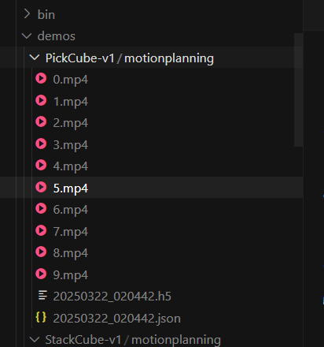

# Motion Planning

ManiSkill provides simple tools to generate robot trajectories using motion planning, primarily through the open-source [mplib](https://github.com/haosulab/MPlib) library. If you have installed ManiSkill, mplib will be installed along with it, so no additional installation is required.

For in-depth tutorials on how to use more advanced features of mplib, please check their documentation: https://motion-planning-lib.readthedocs.io/latest/. Otherwise, this section will introduce some example code that you can use to modify and generate motion planning demonstrations. The example code here is written for the Panda robotic arm but can be modified to work with other robots.

## Motion Planning with Panda Robotic Arm

We provide some built-in motion planning solutions for some tasks using the Panda robotic arm, located at https://github.com/haosulab/ManiSkill/tree/main/mani_skill/examples/motionplanning/panda. You can run the quick demonstration below, which will save the trajectory data as .h5 files to `demos/motionplanning/<env_id>` and optionally save videos and/or visualize using the GUI.

```bash
python -m mani_skill.examples.motionplanning.panda.run -e "PickCube-v1" --save-video # Run in headless mode, only save video
python -m mani_skill.examples.motionplanning.panda.run -e "StackCube-v1" --vis # Open GUI
python -m mani_skill.examples.motionplanning.panda.run -h # Open help menu and show which tasks have solutions
```

The solutions for these tasks typically involve breaking down the task into a series of simple picking, placing, and moving movements. The provided example code controls the Panda robotic arm's end-effector to move to any pose in its workspace, as well as grasping/releasing.

For example, the PickCube-v1 task consists of the following steps:

1. Move the gripper directly above the red cube and adjust the gripper orientation to match the cube's orientation
2. Move the gripper down so that the fingers surround the cube
3. Close the gripper
4. Move the gripper above the target position so that the gripper's tool center point (tcp) is at the target position

Note that while motion planning can generate and solve a wide variety of tasks, its main limitation is that it usually requires manual/engineer adjustment and coding, and cannot generate solutions for more dynamic tasks.
```

(dl) kewei@sxy-gpus3090:~$ python -m mani_skill.examples.motionplanning.panda.run -e "PickCube-v1" --save-video

/home/kewei/micromamba/envs/dl/lib/python3.9/site-packages/torch/random.py:183: UserWarning: CUDA reports that you have 4 available devices, and you have used fork_rng without explicitly specifying which devices are being used. For safety, we initialize *every* CUDA device by default, which can be quite slow if you have a lot of CUDAs. If you know that you are only making use of a few CUDA devices, set the environment variable CUDA_VISIBLE_DEVICES or the 'devices' keyword argument of fork_rng with the set of devices you are actually using. For example, if you are using CPU only, set device.upper()_VISIBLE_DEVICES= or devices=[]; if you are using device 0 only, set CUDA_VISIBLE_DEVICES=0 or devices=[0].  To initialize all devices and suppress this warning, set the 'devices' keyword argument to `range(torch.cuda.device_count())`.
  warnings.warn(message)
Motion Planning Running on PickCube-v1
proc_id: 0: 100%|█| 10/10 [00:59<00:00,  5.91s/it, success_rate=1, failed_motion_pla

Generated path

~/demos/PickCube-v1/motionplanning/0.mp4



# Teleoperation

ManiSkill provides many teleoperation systems to help collect demonstration data in tasks. Each system is detailed below, including how to use it, demonstration videos, hardware requirements, availability, and limitations of the system.

Currently, there are intuitive click+drag systems, systems using devices such as space mice, and VR headset systems are coming soon.

## Click+Drag System

**Requirements:** Monitor, mouse, keyboard

**Availability:** Very easy to generate fine-grained demonstrations

**Limitations:** Limited to solving tasks with low dynamics requirements and using two-finger grippers, such as picking up cubes. Tasks like throwing cubes are not possible.

To start the system, you can specify the task ID with `-e` and run:

```bash
python -m mani_skill.examples.teleoperation.interactive_panda -e "StackCube-v1"
```

Then, you can drag the robot arm's end-effector to any position and rotation, and press the "n" key on the keyboard to generate a trajectory to that position (completed through motion planning). Each time the system will also print current information about whether the task is solved.

You can press the "g" key to toggle the gripper between closed and open.

To complete the collection of one trajectory and continue to the next trajectory, simply press the "c" key, which will save the last trajectory.

To stop data collection, press the "q" key to exit. This will then save the trajectory data to your `demos/teleop/<env_id>` folder. Additionally, it will generate videos of the demonstrations afterward and place them in the same folder, which you can stop by pressing CTRL+C to stop the script.

You can press the "h" key at any time to bring up a help menu describing the keyboard commands.

Use wasd and right-click to adjust camera view, scroll wheel to adjust distance.

## Meta Quest 3

Currently under development (WIP)

## Apple Vision Pro

Currently under development (WIP)