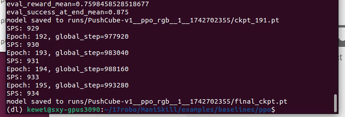

Read file: /home/kewei/17robo/ManiSkill/examples/baselines/ppo/README.md

# Proximal Policy Optimization (PPO)

The code for the PPO reinforcement learning algorithm is adapted from [CleanRL](https://github.com/vwxyzjn/cleanrl/) and [LeanRL](https://github.com/pytorch-labs/LeanRL/). The code is designed as a single file for easy understanding and reading, supporting both state-based reinforcement learning and vision-based reinforcement learning.

Please note that ManiSkill is still in the testing phase, so we have not yet completed training scripts for all pre-built tasks (some of which are difficult to solve with RL alone).

Official benchmark results can be obtained by running the scripts in the baselines.sh file. Results have been compiled and published in our [wandb report](https://api.wandb.ai/links/stonet2000/k6lz966q).

There is also experimental support based on LeanRL, including compiled PPO and CUDA Graphs enabled. The code is in ppo_fast.py, and you need to install [torchrl](https://github.com/pytorch/rl) and [tensordict](https://github.com/pytorch/tensordict/):

```bash
pip install torchrl tensordict
```

## State-based Reinforcement Learning

Here are some example commands you can run to train state-based policies to solve various PPO tasks that have been slightly adjusted. The fastest is the PushCube-v1 task, which takes less than a minute to train on GPU, while the PickCube-v1 task takes 2-5 minutes on GPU.

The PPO benchmark is not guaranteed to work for all tasks, as some tasks do not yet have dense rewards, have not been well-tuned, or are simply difficult for standard PPO to solve.

```bash
python ppo.py --env_id="PushCube-v1" \
  --num_envs=2048 --update_epochs=8 --num_minibatches=32 \
  --total_timesteps=2_000_000 --eval_freq=10 --num-steps=20
```

To evaluate, you can run:

```bash
python ppo.py --env_id="PushCube-v1" \
   --evaluate --checkpoint=path/to/model.pt \
   --num_eval_envs=1 --num-eval-steps=1000
```

Note that when using `--evaluate`, trajectories are saved from GPU simulation. To properly replay these trajectories using the `maniskill.trajectory.replay_trajectory` tool, the number of evaluation environments must be fixed to `1` for some tasks. This is necessary to ensure reproducibility for tasks with geometric randomization (e.g., PickSingleYCB). Other tasks without geometric randomization (like PushCube) can have an increased number of evaluation environments.

The examples.sh file contains a complete list of tested commands for successfully running state-based PPO on many tasks.

Results of the state-based PPO benchmark script are available here: https://api.wandb.ai/links/stonet2000/k6lz966q.

## Vision-based (RGB) Reinforcement Learning

Here are some slightly adjusted example commands for training image-based PPO policies. Again, the fastest is PushCube-v1, taking about 1-5 minutes, while PickCube-v1 takes 15-45 minutes. You should adjust the `--num_envs` parameter based on your GPU memory, as rendering visual observations requires significant memory. The settings below should use less than 15GB of GPU memory. The examples.sh file contains a complete list of tested commands for successfully running RGB-based PPO on many tasks.

```bash
python ppo_rgb.py --env_id="PushCube-v1" \
  --num_envs=256 --update_epochs=8 --num_minibatches=8 \
  --total_timesteps=1_000_000 --eval_freq=10 --num-steps=20
python ppo_rgb.py --env_id="PickCube-v1" \
  --num_envs=256 --update_epochs=8 --num_minibatches=8 \
  --total_timesteps=10_000_000
python ppo_rgb.py --env_id="AnymalC-Reach-v1" \
  --num_envs=256 --update_epochs=8 --num_minibatches=32 \
  --total_timesteps=10_000_000 --num-steps=200 --num-eval-steps=200 \
  --gamma=0.99 --gae_lambda=0.95
```



To evaluate a trained policy, you can run:

```bash
python ppo_rgb.py --env_id="PickCube-v1" \
  --evaluate --checkpoint=path/to/model.pt \
  --num_eval_envs=1 --num-eval-steps=1000
```

This will save videos to `path/to/test_videos`.

The examples.sh file contains a complete list of tested commands for successfully running RGB-based PPO on many tasks.

Results of the RGB-based PPO benchmark script are available here: https://api.wandb.ai/links/stonet2000/k6lz966q

## Vision-based (RGB+Depth) Reinforcement Learning

Under development

## Vision-based (Point Cloud) Reinforcement Learning

Under development

## Replaying Evaluation Trajectories

It can be useful to get better-looking videos. A simple method is to first use the evaluation script provided above. It will save a .h5 and .json file named with the date and time, which you can then replay with different settings as follows:

```bash
python -m mani_skill.trajectory.replay_trajectory \
  --traj-path=path/to/trajectory.h5 --use-env-states --shader="rt-fast" \
  --save-video --allow-failure -o "none"
```

This will replay trajectories using environment states, enable ray tracing (there's also "rt", which is higher quality but slower), and save all videos, including failed trajectories.

## Some Notes

- Evaluating with GPU simulation (especially for randomized objects) is a bit tricky. We recommend reading [our documentation](https://maniskill.readthedocs.io/en/latest/user_guide/reinforcement_learning/baselines.html#evaluation) on how to fairly evaluate policies using GPU simulation.
- Many tasks support visual observations, but we have not carefully verified whether the camera positions for tasks are set appropriately to allow solving certain tasks through visual observation.

## Citation

If you use this benchmark, please cite the following:

```
@article{DBLP:journals/corr/SchulmanWDRK17,
  author       = {John Schulman and
                  Filip Wolski and
                  Prafulla Dhariwal and
                  Alec Radford and
                  Oleg Klimov},
  title        = {Proximal Policy Optimization Algorithms},
  journal      = {CoRR},
  volume       = {abs/1707.06347},
  year         = {2017},
  url          = {http://arxiv.org/abs/1707.06347},
  eprinttype    = {arXiv},
  eprint       = {1707.06347},
  timestamp    = {Mon, 13 Aug 2018 16:47:34 +0200},
  biburl       = {https://dblp.org/rec/journals/corr/SchulmanWDRK17.bib},
  bibsource    = {dblp computer science bibliography, https://dblp.org}
}
```
