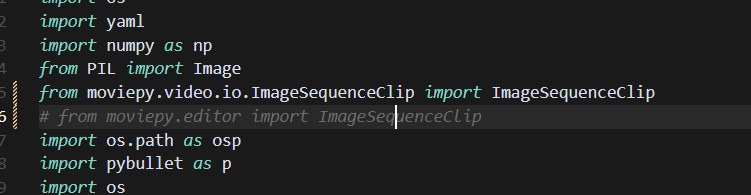
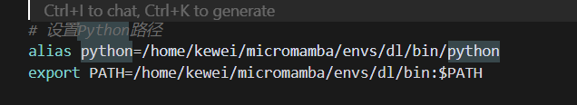

```
   # Clone the RoboGen repository
   git clone https://github.com/Genesis-Embodied-AI/RoboGen.git

   # Set up the environment
   conda env create -f environment.yaml
   conda activate robogen

   # Set the OpenAI API key at the top of gpt_4/query.py

   # Generate tasks related to microwave
   python run.py --category Microwave
   pip install openai pybullet 

   # Or generate tasks based on specific descriptions
   python gpt_4/prompts/prompt_from_description.py --task_description "A mobile franka arm heats the corn with the bowl and the microwave" --object "Microwave"
```



Need to modify moviepy related parts

```ag-0-1inqkk4k9ag-1-1inqkk4kaag-0-1inqkk4k9ag-1-1inqkk4ka
(robogen) kewei@sxy-gpus3090:~/17robo/RoboGen$ python -c "import pybullet; print('成功')"
Traceback (most recent call last):
  File "<string>", line 1, in <module>
ModuleNotFoundError: No module named 'pybullet'
(robogen) kewei@sxy-gpus3090:~/17robo/RoboGen$ which python
/home/kewei/micromamba/envs/robogen/bin/python
(robogen) kewei@sxy-gpus3090:~/17robo/RoboGen$    /home/kewei/micromamba/envs/robogen/bin/python -c "import pybullet; print('成功')"
pybullet build time: Sep  3 2024 12:55:23

A module that was compiled using NumPy 1.x cannot be run in
NumPy 2.0.2 as it may crash. To support both 1.x and 2.x
versions of NumPy, modules must be compiled with NumPy 2.0.
Some module may need to rebuild instead e.g. with 'pybind11>=2.12'.

If you are a user of the module, the easiest solution will be to
downgrade to 'numpy<2' or try to upgrade the affected module.
We expect that some modules will need time to support NumPy 2.

Traceback (most recent call last):  File "<string>", line 1, in <module>
AttributeError: _ARRAY_API not found
Traceback (most recent call last):
  File "<string>", line 1, in <module>
ImportError: numpy.core.multiarray failed to import
```

This is due to an issue with my bashrc settings:



I took a shortcut by not installing Python in the main environment, haha, it seems that's not a good idea.

But the second option can be kept for now, which gives us nvitop and jupyter in the dl environment

To install OMPL from source, run

    ./install_ompl_1.5.2.sh --python

This will install ompl using the system-wide python. Note that line 19 of the installation script requires you to run `sudo apt-get -y upgrade`. This might cause issues with your system packages, so you can comment out this line during installation (installation might fail, commented line is not fully tested). Then export the installation to your conda environment for use with RoboGen:

    echo "/home/kewei/17robo/RoboGen/ompl-1.5.2/py-bindings" >> ~/micromamba/envs/robogen/lib/python3.9/site-packages/ompl.pth
    
    echo "/home/kewei/17robo/RoboGen/ompl-1.5.2/py-bindings" >> ~/miniconda3/envs/robogen/lib/python3.9/site-packages/ompl.pth

Remember to change the paths to your ompl installation path and conda environment path.

[dataset.zip - Google Drive](https://drive.google.com/file/d/1d-1txzcg_ke17NkHKAolXlfDnmPePFc6/view)

Download this

Extract to data/dataset

[objaverse-sentence-bert-embeddings.zip - Google Drive](https://drive.google.com/file/d/1dFDpG3tlckTUSy7VYdfkNqtfVctpn3T6/view)

objaverse_utils/data/